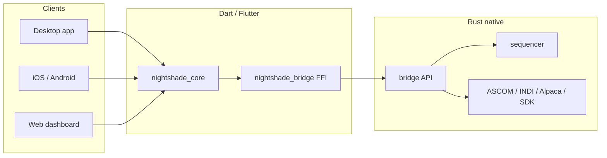

<div align="center">


# Nightshade

**One app for your entire imaging night.**

Camera control, behavior-tree sequencing, plate solving, guiding, planetarium, weather safety, and remote control — on Windows, Linux, and macOS, with iOS and Android companions.

[](https://github.com/Scdouglas1999/Nightshade/releases/latest)
[](https://github.com/Scdouglas1999/Nightshade/actions/workflows/ci.yml?query=branch%3Amain)

[](LICENSE)
[](docs/index.md)

[Download latest release](https://github.com/Scdouglas1999/Nightshade/releases/latest) · [Documentation](docs/index.md) · [Changelog](CHANGELOG.md) · [Contributing](CONTRIBUTING.md)

<br>


*Dashboard — session overview, live preview, quick actions, and weather at a glance.*

</div>

> **Beta (v2.6.0)** — On the `beta` update channel after a long internal hardening pass. Plan Tonight, working plate solving, defect-map calibration without darks, web dashboard, mobile companion, and NINA/SGP import ship in this cut; stable follows a longer soak. [Report issues](https://github.com/Scdouglas1999/Nightshade/issues) with device, backend, OS, and the action that failed.

---

## Why Nightshade

Nightshade replaces the patchwork of capture apps, sequence editors, planetarium tools, and remote dashboards with a single **Flutter + Rust** stack tuned for unattended multi-target nights.

| | |
|---|---|
| **Unified rig control** | Connect ASCOM, Alpaca, INDI, or native SDK devices from one equipment profile |
| **Behavior-tree sequencer** | Drag-and-drop automation with triggers, recovery, meridian flips, and checkpoint resume |
| **Plan Tonight** | Scored target recommendations with altitude, moon, and horizon constraints — re-evaluates on weather and guiding events |
| **Plate solving that works** | ASTAP and astrometry.net auto-detect; centering, framing, and polar wizards require a real solver |
| **Image without darks** | Defect-map pipeline replaces hot pixels at capture time using temperature-bucketed dark stacks |
| **Migrate from NINA / SGP** | Import with a node-mapping preview; unsupported nodes error or preserve raw fields on force-import |
| **Remote from anywhere** | LAN web dashboard, headless API, and iOS/Android companion with QR pairing |

---

## Screenshots

<table>
<tr>
<td width="50%" align="center"><strong>Sequencer</strong><br><br></td>
<td width="50%" align="center"><strong>Plan Tonight</strong><br><br></td>
</tr>
<tr>
<td width="50%" align="center"><strong>Planetarium</strong><br><br></td>
<td width="50%" align="center"><strong>Framing</strong><br><br></td>
</tr>
<tr>
<td width="50%" align="center"><strong>Imaging</strong><br><br></td>
<td width="50%" align="center"><strong>Guiding</strong><br><br></td>
</tr>
<tr>
<td width="50%" align="center"><strong>Equipment</strong><br><br></td>
<td width="50%" align="center"><strong>Weather</strong><br><br></td>
</tr>
<tr>
<td width="50%" align="center"><strong>Analytics</strong><br><br></td>
<td width="50%" align="center"><strong>Flat Wizard</strong><br><br></td>
</tr>
<tr>
<td width="50%" align="center"><strong>Web dashboard</strong><br><br></td>
<td width="50%" align="center"><strong>Settings</strong><br><br></td>
</tr>
</table>

Screenshots captured from **Nightshade 2.6.0** on Windows. See [`assets/README.md`](assets/README.md) for file naming and refresh instructions.

---

## Hardware support

Three driver backends, plus native vendor SDKs where they make sense:

| Backend | Windows | macOS | Linux | Use case |
|---------|:-------:|:-----:|:-----:|----------|
| ASCOM COM | ✓ | — | — | Locally installed ASCOM Platform drivers |
| ASCOM Alpaca | ✓ | ✓ | ✓ | Network REST; any Alpaca server or bridge |
| INDI | ✓ | ✓ | ✓ | Reachable INDI server |
| Native SDK | ✓ | partial | partial | Direct vendor library (bypasses ASCOM/INDI) |

**Native cameras:** ZWO ASI, QHY, Player One, SVBony, Atik, FLI, Moravian, Touptek family (Touptek, Altair, Mallincam, OGMA). **Native mounts:** SkyWatcher/Synta, iOptron, LX200 (serial).

Focusers, filter wheels, rotators, domes, and weather devices use ASCOM, Alpaca, or INDI. See the [supported hardware matrix](docs/supported-hardware-by-platform.md) for platform-specific coverage.

---

## Platforms

| | Windows | Linux | macOS | iOS | Android |
|---|:---:|:---:|:---:|:---:|:---:|
| Desktop app | tested | early testing | untested | — | — |
| Headless server | tested | early testing | untested | — | — |
| Web dashboard | ✓ | ✓ | ✓ | ✓ | ✓ |
| Companion app | — | — | — | ✓ | ✓ |

Windows is the most exercised path. Linux and macOS build and should run; beta feedback on those platforms is especially valuable.

---

## Install

Download from the **[latest release](https://github.com/Scdouglas1999/Nightshade/releases/latest)**:

| Platform | Artifact |
|----------|----------|
| Windows installer | `NightshadeSetup-2.6.0.exe` |
| Windows OTA | `nightshade-2.6.0-windows-x64.zip` + `manifest.json` |
| Linux | `nightshade-2.6.0-linux-x64.tar.gz` |
| Android | `nightshade-2.6.0-android.apk` (debug-signed for beta) |
| iOS | Build from source |

**Windows:** Windows 10/11 x64. [ASCOM Platform](https://ascom-standards.org/) optional but enables local COM drivers.

**Linux:** Built for Ubuntu 22.04+; needs `libgtk-3`, `libsecret-1`, and glibc. Native SDK paths may need vendor udev rules and group membership (`dialout`, `plugdev`, etc.).

New to Nightshade? Start with the [installation guide](docs/getting-started/installation.md) and [first connection walkthrough](docs/getting-started/first-connection.md).

---

## Documentation

| Guide | Description |
|-------|-------------|
| [**User documentation**](docs/index.md) | Install, first connection, features, troubleshooting |
| [**Supported hardware**](docs/supported-hardware-by-platform.md) | Platform and driver matrix |
| [**Known limitations**](docs/known-limitations.md) | Release-scope caveats |
| [**Headless / remote setup**](docs/headless-secure-setup.md) | Token auth, firewall, LAN dashboard |
| [**FFI troubleshooting**](docs/FRB_TROUBLESHOOTING.md) | Codegen / `CPATH` issues when building |
| [**Changelog**](CHANGELOG.md) | Version history |

---

## Build from source

Requirements: [Flutter](https://flutter.dev/) 3.35+, [Rust](https://rustup.rs/) stable (2021 edition), [Melos](https://melos.invertase.dev/).

```bash
git clone https://github.com/Scdouglas1999/Nightshade.git
cd Nightshade
dart pub global activate melos
melos bootstrap
melos run dev
```

`melos run dev` builds the Rust bridge, regenerates FFI bindings, and runs the desktop app. Use `melos run dev:quick` when only Rust implementation changed (not the API), and `melos run dev:clean` for a full reset.

**Build dependencies**

- **Windows:** Visual Studio 2022 (C++), LLVM/Clang on `PATH`
- **Linux:** `build-essential clang cmake ninja-build pkg-config libgtk-3-dev libsecret-1-dev libjsoncpp-dev`
- **macOS:** Xcode command-line tools

Architecture and package layout for contributors: [CLAUDE.md](CLAUDE.md) and [CONTRIBUTING.md](CONTRIBUTING.md).



---

## Contributing

Bug reports with **device, backend, OS, and reproduction steps** are the most valuable beta contribution. Use the [bug report template](https://github.com/Scdouglas1999/Nightshade/issues/new?template=bug_report.yml).

For code changes, read [CONTRIBUTING.md](CONTRIBUTING.md). Substantial features should start with an issue for design alignment. Security issues: [SECURITY.md](SECURITY.md) (private report, not a public issue).

---

## License

Source-available—not open source. You may view and study the code; redistribution, modification, and derivative works require explicit permission. See [LICENSE](LICENSE).

---

## Acknowledgments

Nightshade builds on community standards and libraries: [ASCOM](https://ascom-standards.org/), [INDI](https://indilib.org/), [PHD2](https://openphdguiding.org/), [Flutter](https://flutter.dev/), [Rust](https://www.rust-lang.org/), [flutter_rust_bridge](https://cjycode.com/flutter_rust_bridge/), and [LibRaw](https://www.libraw.org/).

Clear skies.
