<div align="center">

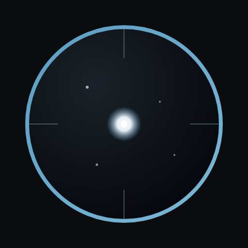

# Nightshade

**One app for your entire imaging night.**

Connect ASCOM, Alpaca, INDI, or native SDK hardware from a single equipment profile. Run unattended multi-target nights with the behavior-tree sequencer and Plan Tonight scheduling, then supervise or intervene from the desktop app, browser dashboard, or mobile companion.

[](https://github.com/Scdouglas1999/Nightshade/releases/latest)
[](https://github.com/Scdouglas1999/Nightshade/actions/workflows/ci.yml?query=branch%3Amain)

[](LICENSE)
[](docs/index.md)

[Download latest release](https://github.com/Scdouglas1999/Nightshade/releases/latest) · [Documentation](docs/index.md) · [Changelog](CHANGELOG.md) · [Contributing](CONTRIBUTING.md)

<br>

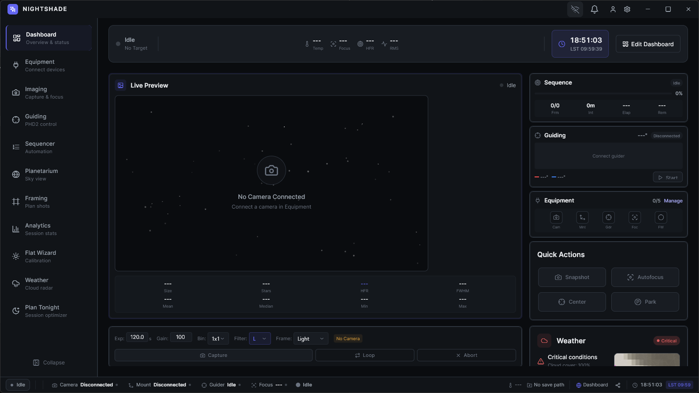

*The home dashboard: live preview and capture controls, equipment connection state, guiding and weather tiles, session progress, and quick actions for the night ahead.*

</div>

> **Beta (v2.6.0)** — Delivered on the `beta` update channel after an extended hardening pass. Plan Tonight, working plate solving, defect-map calibration without darks, the web dashboard, mobile companion, and NINA/SGP import are in this build; stable follows a longer soak. [Report issues](https://github.com/Scdouglas1999/Nightshade/issues) with device, backend, OS, and the steps that failed.

## Contents

- [Why Nightshade](#why-nightshade)
- [Walk through a night](#walk-through-a-night)
- [Hardware support](#hardware-support)
- [Platforms](#platforms)
- [Install](#install)
- [Documentation](#documentation)
- [Build from source](#build-from-source)
- [Contributing](#contributing)
- [License](#license)

---

## Why Nightshade

Most imaging nights still mean juggling a capture app, a sequence editor, a planetarium, and a separate remote dashboard—each with its own profiles, failure modes, and “did that actually work?” moments. Nightshade replaces that patchwork with one desktop suite for the full night: connect the rig once, plan targets, run unattended sequences, and monitor or intervene from the same place when conditions change.

**Capture & automation** — One equipment profile drives camera, mount, focuser, filter wheel, dome, and weather across ASCOM, Alpaca, INDI, or native SDK paths. The behavior-tree sequencer combines instructions, parallel triggers (HFR, guiding, time), and recovery so meridian flips, autofocus, dithering, and checkpoint resume stay in one canvas.

**Planning & solving** — Plan Tonight scores targets for altitude, moon, and horizon; the scheduler can re-evaluate when conditions shift. Plate solving uses ASTAP or astrometry.net (verified at setup) for framing and recovery—not placeholder coordinates.

**Safety & remote** — Radar, cloud-motion cues, and sequence-integrated alerts can pause or park before weather costs you a run. The same session is visible from the browser dashboard or iOS/Android companion (QR pairing) without a second stack on the observatory PC.

**Migration & calibration** — Defect-map calibration from a short dark stack repairs hot pixels at capture time. NINA and SGP sequences import with a mapping preview; unsupported steps surface clearly. A guided equipment wizard walks new rigs from driver choice through optical train and save path.

---

## Walk through a night

Follow the flow below the way most imagers use Nightshade on a clear night. Screenshots are from **Nightshade 2.6.0 on Windows** ([latest release](https://github.com/Scdouglas1999/Nightshade/releases/latest)). Each step is one screen, one job—open it when you need that part of the night, then move on.

### Connect your rig

Before you slew or expose, bind the observatory into one profile. Discover cameras, mounts, focusers, and wheels across ASCOM COM, Alpaca, INDI, or native SDK backends, confirm connection health, and save the profile so every other screen talks to the same rig. When something drops offline, you fix it here instead of chasing drivers in three apps.

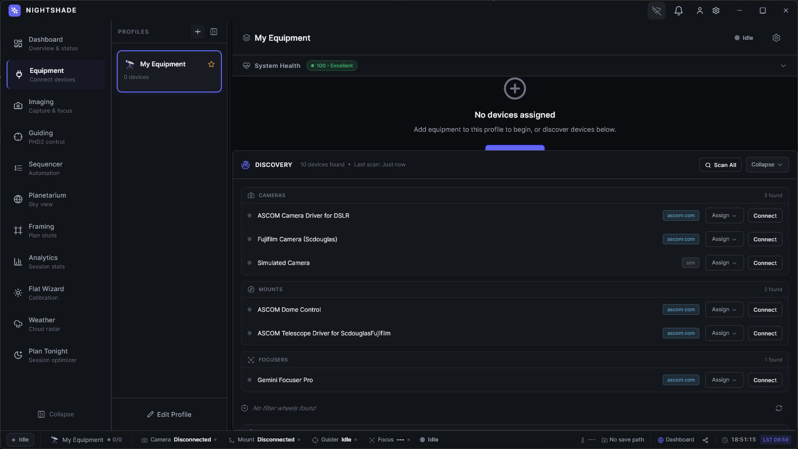

*Equipment: discovery, driver choice, and per-device connection state for the active profile.*

### Tune profiles and optics

Open saved equipment profiles when focal length, plate scale, or device roles change—after a reducer, a new camera, or a solver tweak. Framing, plate solving, and the sequencer read these defaults; keeping optics accurate here prevents offset and scale mistakes later in the night.

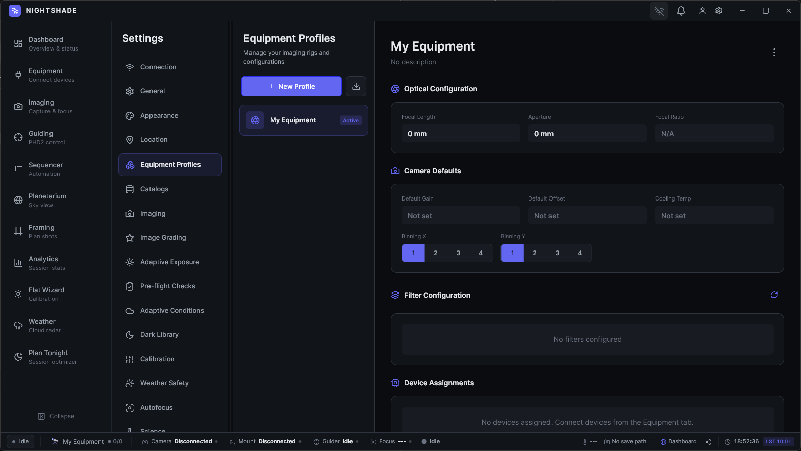

*Equipment profiles: optics, device roles, and solver-related defaults for this rig.*

### Choose what to shoot

Use the planetarium to pan the sky, search objects, and read tonight’s visibility before you commit integration time. When you know the field you want, hand targets to Plan Tonight or drop them straight into the sequencer.

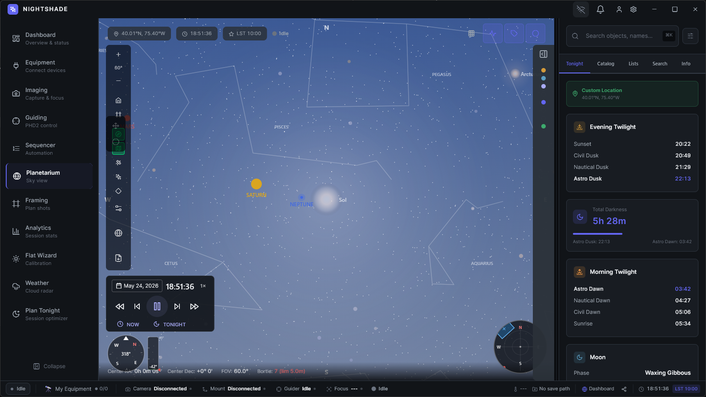

*Planetarium: interactive sky map, search, and tonight’s visibility panel.*

### Let Plan Tonight rank targets

Plan Tonight scores candidates for altitude, moon separation, and horizon limits, then shows when each object is worth shooting. Pick the next target from data instead of a static list you wrote at dusk; the scheduler can re-rank when weather or guiding shifts.

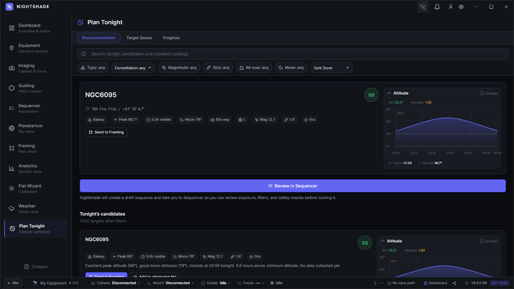

*Plan Tonight: scored target list and altitude chart for the rest of the night.*

### Frame and solve the field

Line up composition with plate solving and a reference overlay (DSS or similar) so rotation and offset match the plan. You spend fewer iterative slews when narrowing in on a faint target or matching a mosaic pane.

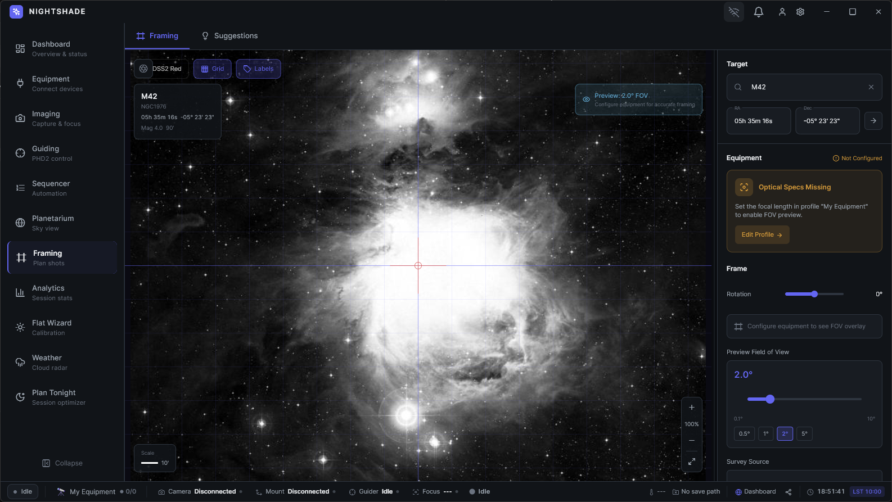

*Framing: plate-solved overlay and reference image for rotation and offset.*

### Build the night in the sequencer

Assemble unattended runs as a behavior tree: expose, slew, filter changes, meridian flips, and parallel triggers in one canvas. Recovery branches and checkpoint resume mean one failed step does not discard the rest of the run—you adjust the tree, not a pile of scripts.

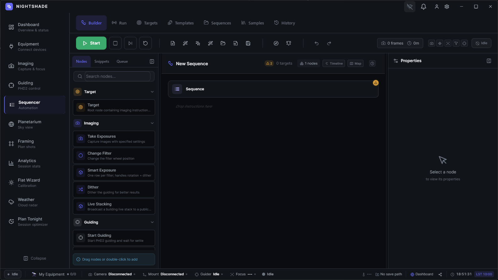

*Sequencer: instructions, triggers, and recovery branches on one canvas.*

### Capture lights and calibration

Run exposures from the imaging workspace: exposure controls, live histogram, and frame metadata in one place. Defect-map calibration can run at capture time so hot pixels are handled without maintaining separate dark libraries for every temperature.

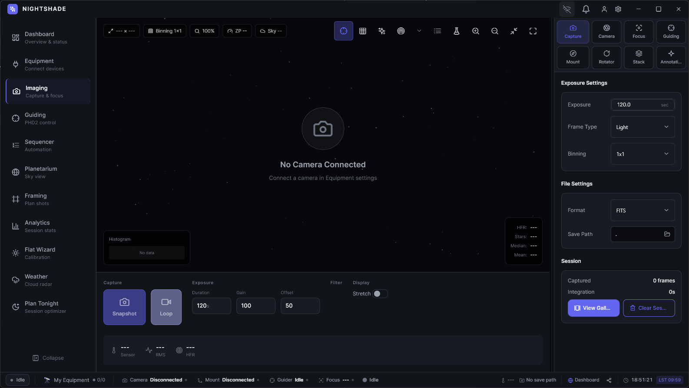

*Imaging: capture controls, histogram, and frame metadata.*

### Keep guiding on track

Operate PHD2 inside Nightshade—star profile, guiding RMS, and dither settings without alt-tabbing. Sequencer triggers can react when tracking degrades so capture pauses before trailed frames stack up.

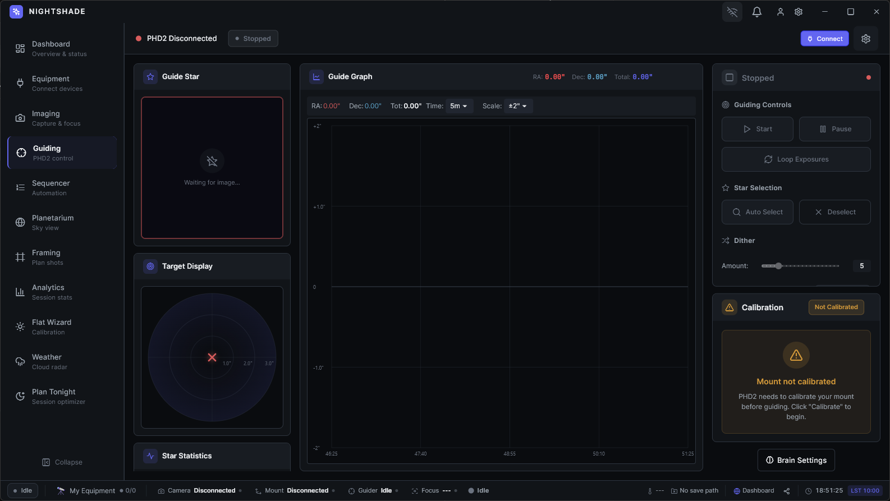

*Guiding: PHD2 star profile, RMS trends, and dither controls.*

### Watch the sky

Monitor radar and cloud signals beside observatory conditions when you decide whether to pause, park, or let automation continue. Plan Tonight and the sequencer can factor weather into decisions so you are not the only watcher when a front moves in.

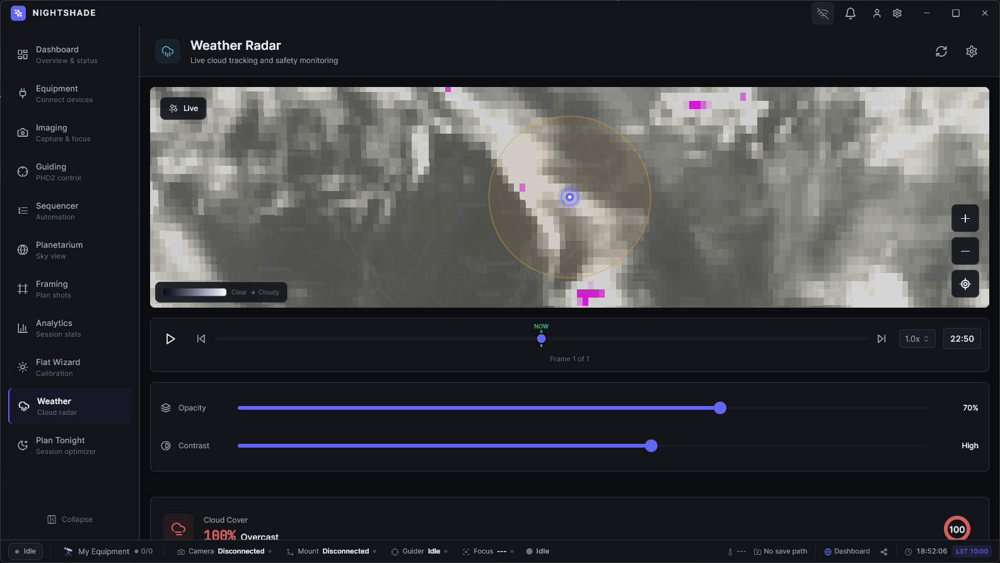

*Weather: radar, cloud cues, and safety-oriented conditions.*

### Review session quality

During or after capture, scan frame quality, HFR trends, and guiding performance in one analytics view. Spot when seeing softened or autofocus drifted without opening every FITS header by hand.

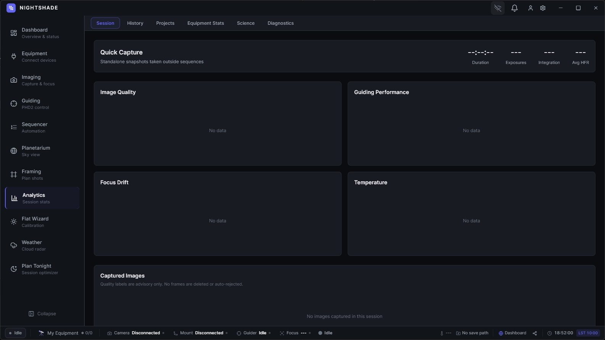

*Analytics: frame quality, HFR, and guiding trends for the session.*

### Run flats between targets

When the sequencer calls for calibration—or you need a quick flat series before meridian—use the flat wizard for filter-aware panels and ADU targeting so flats land in the right brightness range.

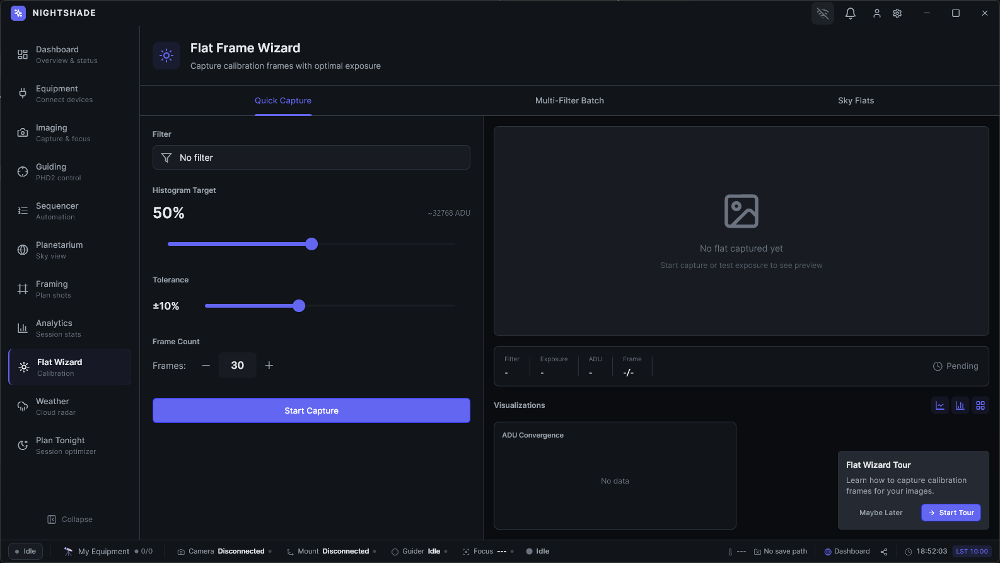

*Flat wizard: filter-aware panels and ADU targeting.*

### Step away with remote access

Leave the observatory PC running headless or on the LAN, then open the browser dashboard for session status, preview, and core actions from inside the house or on a tablet. Return to equipment profiles on the desktop when you need to edit optics or device roles without sitting at the pier.

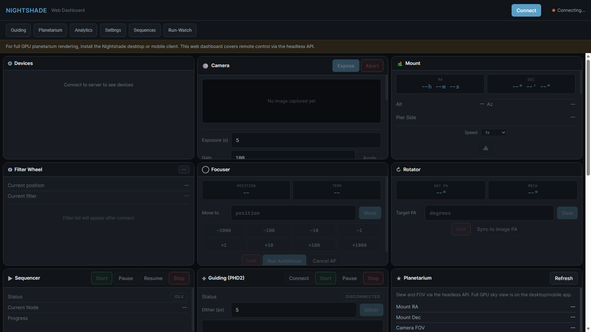

*Web dashboard: session status and core actions from a browser on your LAN.*

Screenshot refresh notes: [`assets/README.md`](assets/README.md).

---

## Hardware support

Nightshade talks to rigs through four driver backends. Availability means discovery and connection are implemented on that OS; individual devices may still expose narrower capabilities after connect.

| Backend | Windows | Linux | macOS |
|---------|:-------:|:-----:|:-----:|
| ASCOM COM | ✓ | — | — |
| ASCOM Alpaca | ✓ | ✓ | ✓ |
| INDI | ✓ | ✓ | ✓ |
| Native SDK | Gated | Gated | Gated |

- **ASCOM COM** — Locally installed ASCOM Platform and device drivers (Windows only).
- **ASCOM Alpaca** — Network REST; any Alpaca server or ASCOM bridge.
- **INDI** — Reachable INDI server; depth depends on the INDI driver.
- **Native SDK** — Direct vendor libraries where bundled and verified for the OS/CPU; otherwise use ASCOM, Alpaca, or INDI.

**Native cameras (SDK):** ZWO ASI, QHY, Player One, SVBony, Atik, FLI, Moravian, Touptek family (Touptek, Altair, Mallincam, OGMA).

**Native mounts (SDK):** SkyWatcher/Synta, iOptron, LX200 (serial).

Focusers, filter wheels, rotators, domes, weather, and safety devices use ASCOM, Alpaca, or INDI unless a native path is explicitly verified for your release. Full backend × category matrix: [Supported hardware by platform](docs/supported-hardware-by-platform.md).

---

## Platforms

| Surface | Windows | Linux | macOS | iOS / Android |
|---------|---------|-------|-------|---------------|
| Desktop app | Tested | Early testing | Untested | — |
| Headless server + API | Tested | Early testing | Untested | — |
| Web dashboard | ✓ | ✓ | ✓ | ✓ |
| Mobile companion | — | — | — | ✓ |

**Desktop and headless** — Windows is the primary beta path (installer, OTA, and field use). Linux builds ship and run on CI; real-hardware and packaging feedback is welcome. macOS compiles in CI but has no signed beta artifact and no dedicated hardware soak for this release.

**Web dashboard** — Browser UI against a running desktop or headless host on your LAN (REST + WebSocket). Not a standalone cloud service.

**Mobile companion** — iOS and Android apps pair to the desktop host via QR; remote monitoring and light control, not a full capture replacement. Android ships as a debug-signed beta APK; iOS requires building from source (see Install).

---

## Install

Download from the **[latest release](https://github.com/Scdouglas1999/Nightshade/releases/latest)** (channel **beta**, version **2.6.0**). Confirm artifact names in the release notes before installing.

| Platform | Artifact |
|----------|----------|
| Windows installer | `NightshadeSetup-2.6.0.exe` |
| Windows OTA | `nightshade-2.6.0-windows-x64.zip` + `manifest.json` |
| Linux | `nightshade-2.6.0-linux-x64.tar.gz` |
| Android (companion) | `nightshade-2.6.0-android.apk` (debug-signed for beta) |
| iOS (companion) | Build from source |
| macOS desktop | Not shipped for v2.6.0 beta |

### Requirements

**Windows** — Windows 10 or 11 (64-bit); 8 GB RAM minimum (16 GB recommended); DirectX 11 GPU with 2 GB VRAM; ~500 MB for the app plus image storage. [.NET Framework 4.8+](https://dotnet.microsoft.com/download/dotnet-framework) and [ASCOM Platform](https://ascom-standards.org/) optional but required for local COM drivers.

**Linux** — Ubuntu 22.04 LTS or equivalent; same CPU/RAM guidance as Windows; OpenGL 3.3 GPU. Runtime needs `libgtk-3`, `libsecret-1`, and a current glibc. INDI equipment needs a reachable INDI server (`indi-full` or your distro’s packages). Native USB/SDK paths may need vendor `udev` rules and group membership (`dialout`, `plugdev`, `video` as applicable).

**macOS / iOS** — See release notes for what is actually attached to the tag; do not assume a `.dmg` or TestFlight build from this table alone.

### Next steps

- [Installation guide](docs/getting-started/installation.md) — extract/install, ASCOM and INDI setup, verify launch, updates.
- [First connection](docs/getting-started/first-connection.md) — equipment profile, protocol choice, first camera/mount connect.

---

## Documentation

| Resource | What you'll find |
|----------|------------------|
| [**User documentation**](docs/index.md) | Installation, first connection, feature guides, troubleshooting, and API references |
| [**Supported hardware**](docs/supported-hardware-by-platform.md) | Driver backends (ASCOM, Alpaca, INDI, native SDK) and platform coverage |
| [**Known limitations**](docs/known-limitations.md) | Release-scope caveats, unsupported paths, and beta expectations |
| [**Headless / remote setup**](docs/headless-secure-setup.md) | Token auth, firewall ports, LAN web dashboard, and OpenAPI self-test |
| [**FFI troubleshooting**](docs/FRB_TROUBLESHOOTING.md) | `flutter_rust_bridge` codegen failures, `CPATH` / header paths, and hash mismatches |
| [**Changelog**](CHANGELOG.md) | Version history and release notes |

For a guided first run after install, see [Installation](docs/getting-started/installation.md) and [First connection](docs/getting-started/first-connection.md).

---

## Build from source

Nightshade is a **Melos** monorepo: Flutter/Dart UI and business logic in `packages/` and `apps/`, device control and sequencing in `native/nightshade_native/` (Rust), connected through **flutter_rust_bridge**.

### Requirements

| Tool | Version / notes |
|------|-----------------|
| [Flutter](https://flutter.dev/) | 3.35+ recommended (CI release builds use 3.35.5; analyzer CI uses 3.24+) |
| [Rust](https://rustup.rs/) | Stable toolchain, 2021 edition |
| [Melos](https://melos.invertase.dev/) | `dart pub global activate melos` |
| Git | Submodules not required for a standard clone |

### Quick start

From the repository root:

```bash
git clone https://github.com/Scdouglas1999/Nightshade.git
cd Nightshade
dart pub global activate melos
melos bootstrap
melos run dev
```

| Command | When to use it |
|---------|----------------|
| `melos run dev` | Full cycle: FRB codegen, Rust build, copy native libs, run desktop app (**Windows**; uses `scripts/dev.ps1`) |
| `melos run dev:quick` | Rust/Dart implementation changed, **FFI API unchanged** (skips FRB regen) |
| `melos run dev:norun` | Rebuild native bridge and bindings without launching Flutter |
| `melos run dev:clean` | Clean artifacts and rebuild from scratch |
| `melos run generate` | Regenerate freezed, drift, json_serializable, and FRB bindings after model/API edits |
| `melos run build:desktop:windows` | Release desktop build (also `build:desktop:linux`, `build:desktop:macos`) |
| `melos run test` | Flutter tests across packages |
| `melos run analyze` | `dart analyze` in all packages |

**Important:** After changing Rust FFI surfaces, do not rely on plain `flutter run` alone—Dart bindings and the native library must stay in sync. Use `melos run dev` on Windows, or run `flutter_rust_bridge_codegen generate`, `scripts/build_native.sh` (Linux/macOS), copy the built library into the app output, then `flutter run`. See [FFI troubleshooting](docs/FRB_TROUBLESHOOTING.md).

On **Linux/macOS**, install hooks once: `./scripts/install-hooks.sh`. On **Windows**: `.\scripts\install-hooks.ps1`.

### Build dependencies by OS

| OS | Install before `melos bootstrap` |
|----|----------------------------------|
| **Windows** | Visual Studio 2022 with **Desktop development with C++**; LLVM/Clang on `PATH` (for FRB/ffigen); optional [ASCOM Platform](https://ascom-standards.org/) for local COM drivers |
| **Linux** | `build-essential` `clang` `cmake` `ninja-build` `pkg-config` `libgtk-3-dev` `libsecret-1-dev` `libjsoncpp-dev`; vendor udev rules for native USB cameras where applicable |
| **macOS** | Xcode Command Line Tools; code signing for device builds |

Contributor layout, quality gates, and where to place changes: [CLAUDE.md](CLAUDE.md) (architecture) and [CONTRIBUTING.md](CONTRIBUTING.md) (workflow and CI).

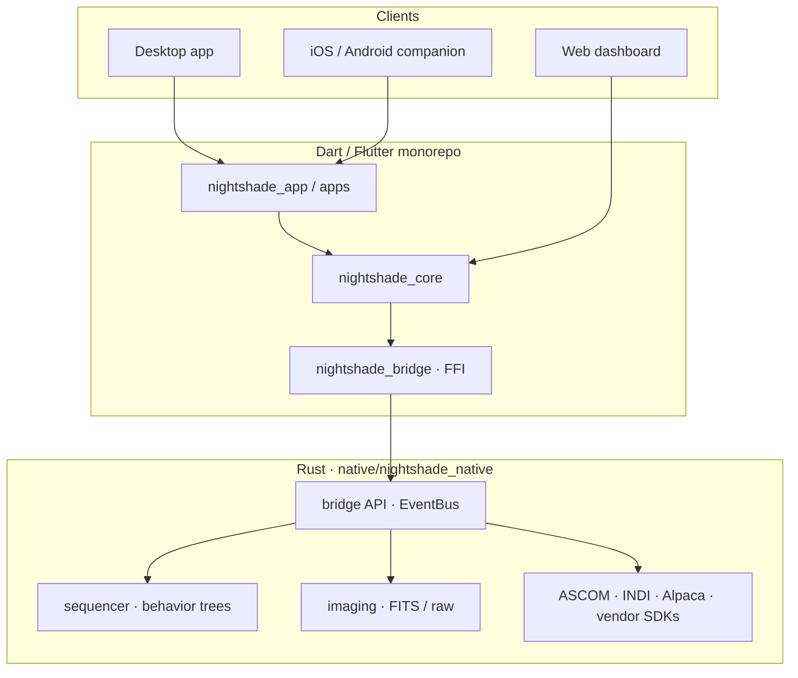

---

## Contributing

Nightshade is in active beta; reproducible reports and small, focused PRs help the most.

**Bug reports** — use the [bug report template](https://github.com/Scdouglas1999/Nightshade/issues/new?template=bug_report.yml). Include **device model**, **driver backend** (ASCOM COM, Alpaca, INDI, native SDK), **OS and version**, Nightshade **version/channel**, and **steps to reproduce** (logs or a short screen recording when possible).

**Code and docs** — read [CONTRIBUTING.md](CONTRIBUTING.md) for bootstrap, pre-commit hooks, CI gates (`melos run analyze`, `melos run audit:placeholders`, Rust `clippy` / tests), and house rules (no stubs, fail-closed errors, regenerate committed codegen in dedicated commits). Substantial features should start with a [feature request](https://github.com/Scdouglas1999/Nightshade/issues/new?template=feature_request.yml) or issue for design alignment.

**Security** — do **not** file public issues for vulnerabilities. Follow [SECURITY.md](SECURITY.md) for private reporting, supported release channels, and scope (trusted LAN vs internet-exposed headless API).

---

## License

Nightshade is **source-available**, not open source. You may use official releases for imaging work, view and study this repository, and build private modifications for equipment you own. Redistribution, sublicensing, and publishing derivative works require **explicit written permission** from the copyright holder. See [LICENSE](LICENSE) for the full terms (Version 1.2).

---

## Acknowledgments

Nightshade integrates with and depends on community standards and open libraries, including:

- **[ASCOM](https://ascom-standards.org/)** and **ASCOM Alpaca** — Windows COM and cross-platform REST device access
- **[INDI](https://indilib.org/)** — Linux/macOS/Windows INDI client protocol
- **[PHD2](https://openphdguiding.org/)** — autoguiding integration
- **[Flutter](https://flutter.dev/)** / **Dart** — cross-platform UI
- **[Rust](https://www.rust-lang.org/)** — native bridge, sequencer, drivers, and imaging
- **[flutter_rust_bridge](https://cjycode.com/flutter_rust_bridge/)** — Dart ↔ Rust FFI
- **[LibRaw](https://www.libraw.org/)** — camera RAW decoding

Clear skies.
