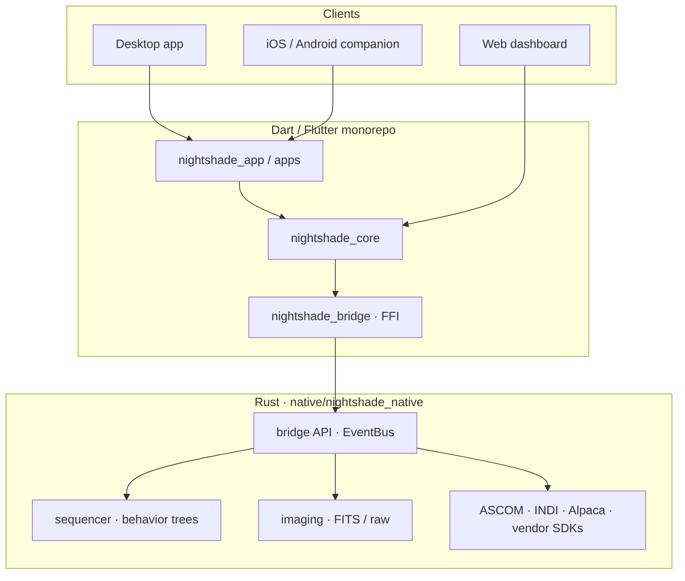

<div align="center">


# Nightshade

**One app for your entire imaging night.**

Connect ASCOM, Alpaca, INDI, or native SDK hardware from a single equipment profile. Run unattended multi-target nights with the behavior-tree sequencer and Plan Tonight scheduling, then supervise or intervene from the desktop app, browser dashboard, or mobile companion.

[](https://github.com/Scdouglas1999/Nightshade/releases/latest)
[](https://github.com/Scdouglas1999/Nightshade/actions/workflows/ci.yml?query=branch%3Amain)

[](LICENSE)
[](docs/index.md)

[Download latest release](https://github.com/Scdouglas1999/Nightshade/releases/latest) · [Documentation](docs/index.md) · [Changelog](CHANGELOG.md) · [Contributing](CONTRIBUTING.md)

<br>


*The home dashboard: live preview and capture controls, equipment connection state, guiding and weather tiles, session progress, and quick actions for the night ahead.*

</div>

> **Beta (v2.6.0)** — Delivered on the `beta` update channel after an extended hardening pass. Plan Tonight, working plate solving, defect-map calibration without darks, the web dashboard, mobile companion, and NINA/SGP import are in this build; stable follows a longer soak. [Report issues](https://github.com/Scdouglas1999/Nightshade/issues) with device, backend, OS, and the steps that failed.

---

## Why Nightshade

Most imaging nights still mean juggling a capture app, a sequence editor, a planetarium, and a separate remote dashboard—each with its own profiles, failure modes, and “did that actually work?” moments. Nightshade replaces that patchwork with one desktop suite for the full night: connect the rig once, plan targets, run unattended sequences, and monitor or intervene from the same place when conditions change.

### Capture & automation

**Unified rig control**  
One equipment profile drives camera, mount, focuser, filter wheel, dome, and weather devices across ASCOM, Alpaca, INDI, or native SDK paths—so you spend less time re-entering connections and more time collecting data.

**Behavior-tree sequencer**  
Build complex nights visually with instructions, parallel triggers, and recovery logic—meridian flips, autofocus between filters, dithering, and checkpoint resume—without stitching together scripts from multiple tools.

### Planning & solving

**Plan Tonight**  
Get scored target recommendations that respect altitude, moon, horizon, and your integration goals, then let the scheduler re-evaluate when weather or guiding shifts—so the rig keeps working the best target instead of a static list you set at dusk.

**Plate solving that works**  
Frame, center, and align with real ASTAP or astrometry.net solvers (auto-detected and verified at setup)—not placeholder coordinates—so slews and recovery actions land where you intend.

### Safety & remote

**Weather safety**  
Radar, cloud-motion cues, and sequence-integrated alerts can pause or park before a front costs you a run—so a surprise cloud bank does not become a ruined session.

**Remote from anywhere**  
Monitor and control the same session from a browser dashboard or iOS/Android companion (QR pairing)—cooling, capture, mount, sequencer, and safety—without a second stack of apps on the observatory PC.

### Migration & calibration

**Image without darks**  
Build a temperature-aware defect map from a short dark stack and apply hot-pixel repair at capture time—clean lights on disk even when you skip traditional dark frames.

**Migrate from NINA / SGP**  
Import competitor sequences with a mapping preview before you commit; unsupported steps surface clearly instead of vanishing silently, so moving your library is a planned transition, not a gamble.

**First-night onboarding**  
A guided equipment wizard and re-runnable tutorial walk new setups from driver choice through optical train and save path—so the first connection night is setup, not guesswork.

---

## Screenshots

A walk through Nightshade **2.6.0 on Windows**—the same beta build linked in [releases](https://github.com/Scdouglas1999/Nightshade/releases/latest). The tour follows a real night: connect the rig, plan and frame targets, run capture and guiding, watch weather and quality, then monitor or adjust from the browser. Captions call out what you accomplish on each screen, not just what is visible.

<table>
<tr>
<td width="50%" valign="top">


<br><br>

**Sequencer**

Build unattended nights as a behavior tree: expose, slew, filter changes, meridian flips, and parallel triggers (HFR, guiding, time) in one canvas. Recovery and checkpoint resume mean a single failed step does not discard the rest of the run.

</td>
<td width="50%" valign="top">


<br><br>

**Plan Tonight**

Pick the next target from scored recommendations that weigh altitude, moon separation, and horizon limits. The altitude chart shows when each object is worth shooting so you spend clear time on data, not spreadsheet math.

</td>
</tr>
</table>

### Run your night

<table>
<tr>
<td width="50%" valign="top">


<br><br>

**Equipment**

Discover cameras, mounts, focusers, and wheels across ASCOM, Alpaca, INDI, or native SDK backends, then bind them into a profile you reuse every night. Connection health and driver choice live here so the rest of the app talks to one consistent rig.

</td>
<td width="50%" valign="top">


<br><br>

**Imaging**

Capture lights and calibration frames with exposure controls, live histogram, and frame metadata in one workspace. Defect-map calibration can run at capture time so hot pixels are handled without juggling separate dark libraries.

</td>
</tr>
<tr>
<td width="100%" valign="top">


<br><br>

**Guiding**

Operate PHD2 from inside Nightshade: star profile, guiding RMS, and dither settings without alt-tabbing. The sequencer and triggers can react to guiding state so capture pauses when tracking degrades.

</td>
</tr>
</table>

### Plan and frame

<table>
<tr>
<td width="50%" valign="top">


<br><br>

**Planetarium**

Pan a GPU-rendered sky map, search objects, and read tonight’s visibility from the side panel. Use it to choose what to shoot before you hand targets to Plan Tonight or the sequencer.

</td>
<td width="50%" valign="top">


<br><br>

**Framing**

Line up the field with plate solving and a DSS (or similar) reference overlay—here on M42—so rotation and offset match the planned composition. Saves iterative slews when you are narrowing in on a faint target.

</td>
</tr>
</table>

### Monitor and calibrate

<table>
<tr>
<td width="50%" valign="top">


<br><br>

**Weather**

Watch radar and cloud signals alongside observatory conditions to decide when to pause or park. Sequencer and Plan Tonight can factor weather into automation so you are not the only thing watching the sky.

</td>
<td width="50%" valign="top">


<br><br>

**Analytics**

Review the night after—or during—capture: frame quality, HFR trends, and guiding performance in one analytics view. Spot when seeing softened or autofocus drifted without digging through individual FITS headers.

</td>
</tr>
<tr>
<td width="100%" valign="top">


<br><br>

**Flat wizard**

Run filter-aware flat panels with ADU targeting so flats land in the right brightness range. Fits between targets when the sequencer calls for calibration or when you need a quick flat series before meridian.

</td>
</tr>
</table>

### Remote and settings

<table>
<tr>
<td width="50%" valign="top">


<br><br>

**Web dashboard**

Control a headless or LAN-hosted rig from the browser: session status, preview, and core actions without the full desktop UI on the observatory PC. Same stack as the mobile companion—useful when you are warm inside or on a tablet.

</td>
<td width="50%" valign="top">


<br><br>

**Equipment profiles**

Edit saved profiles: optics (focal length, plate scale), device roles, and solver-related defaults that framing and plate solving rely on. One profile per rig keeps imports, centering, and sequences aligned with your real hardware.

</td>
</tr>
</table>

Screenshots captured from **Nightshade 2.6.0** on Windows. See [`assets/README.md`](assets/README.md) for file naming and refresh instructions.

---

## Hardware support

Nightshade talks to rigs through four driver backends. Availability means discovery and connection are implemented on that OS; individual devices may still expose narrower capabilities after connect.

| Backend | Windows | Linux | macOS |
|---------|:-------:|:-----:|:-----:|
| ASCOM COM | ✓ | — | — |
| ASCOM Alpaca | ✓ | ✓ | ✓ |
| INDI | ✓ | ✓ | ✓ |
| Native SDK | Gated | Gated | Gated |

- **ASCOM COM** — Locally installed ASCOM Platform and device drivers (Windows only).
- **ASCOM Alpaca** — Network REST; any Alpaca server or ASCOM bridge.
- **INDI** — Reachable INDI server; depth depends on the INDI driver.
- **Native SDK** — Direct vendor libraries where bundled and verified for the OS/CPU; otherwise use ASCOM, Alpaca, or INDI.

**Native cameras (SDK):** ZWO ASI, QHY, Player One, SVBony, Atik, FLI, Moravian, Touptek family (Touptek, Altair, Mallincam, OGMA).

**Native mounts (SDK):** SkyWatcher/Synta, iOptron, LX200 (serial).

Focusers, filter wheels, rotators, domes, weather, and safety devices use ASCOM, Alpaca, or INDI unless a native path is explicitly verified for your release. Full backend × category matrix: [Supported hardware by platform](docs/supported-hardware-by-platform.md).

---

## Platforms

| Surface | Windows | Linux | macOS | iOS / Android |
|---------|---------|-------|-------|---------------|
| Desktop app | Tested | Early testing | Untested | — |
| Headless server + API | Tested | Early testing | Untested | — |
| Web dashboard | ✓ | ✓ | ✓ | ✓ |
| Mobile companion | — | — | — | ✓ |

**Desktop and headless** — Windows is the primary beta path (installer, OTA, and field use). Linux builds ship and run on CI; real-hardware and packaging feedback is welcome. macOS compiles in CI but has no signed beta artifact and no dedicated hardware soak for this release.

**Web dashboard** — Browser UI against a running desktop or headless host on your LAN (REST + WebSocket). Not a standalone cloud service.

**Mobile companion** — iOS and Android apps pair to the desktop host via QR; remote monitoring and light control, not a full capture replacement. Android ships as a debug-signed beta APK; iOS requires building from source (see Install).

---

## Install

Download from the **[latest release](https://github.com/Scdouglas1999/Nightshade/releases/latest)** (channel **beta**, version **2.6.0**). Confirm artifact names in the release notes before installing.

| Platform | Artifact |
|----------|----------|
| Windows installer | `NightshadeSetup-2.6.0.exe` |
| Windows OTA | `nightshade-2.6.0-windows-x64.zip` + `manifest.json` |
| Linux | `nightshade-2.6.0-linux-x64.tar.gz` |
| Android (companion) | `nightshade-2.6.0-android.apk` (debug-signed for beta) |
| iOS (companion) | Build from source |
| macOS desktop | Not shipped for v2.6.0 beta |

### Requirements

**Windows** — Windows 10 or 11 (64-bit); 8 GB RAM minimum (16 GB recommended); DirectX 11 GPU with 2 GB VRAM; ~500 MB for the app plus image storage. [.NET Framework 4.8+](https://dotnet.microsoft.com/download/dotnet-framework) and [ASCOM Platform](https://ascom-standards.org/) optional but required for local COM drivers.

**Linux** — Ubuntu 22.04 LTS or equivalent; same CPU/RAM guidance as Windows; OpenGL 3.3 GPU. Runtime needs `libgtk-3`, `libsecret-1`, and a current glibc. INDI equipment needs a reachable INDI server (`indi-full` or your distro’s packages). Native USB/SDK paths may need vendor `udev` rules and group membership (`dialout`, `plugdev`, `video` as applicable).

**macOS / iOS** — See release notes for what is actually attached to the tag; do not assume a `.dmg` or TestFlight build from this table alone.

### Next steps

- [Installation guide](docs/getting-started/installation.md) — extract/install, ASCOM and INDI setup, verify launch, updates.
- [First connection](docs/getting-started/first-connection.md) — equipment profile, protocol choice, first camera/mount connect.

---

## Documentation

| Resource | What you'll find |
|----------|------------------|
| [**User documentation**](docs/index.md) | Installation, first connection, feature guides, troubleshooting, and API references |
| [**Supported hardware**](docs/supported-hardware-by-platform.md) | Driver backends (ASCOM, Alpaca, INDI, native SDK) and platform coverage |
| [**Known limitations**](docs/known-limitations.md) | Release-scope caveats, unsupported paths, and beta expectations |
| [**Headless / remote setup**](docs/headless-secure-setup.md) | Token auth, firewall ports, LAN web dashboard, and OpenAPI self-test |
| [**FFI troubleshooting**](docs/FRB_TROUBLESHOOTING.md) | `flutter_rust_bridge` codegen failures, `CPATH` / header paths, and hash mismatches |
| [**Changelog**](CHANGELOG.md) | Version history and release notes |

For a guided first run after install, see [Installation](docs/getting-started/installation.md) and [First connection](docs/getting-started/first-connection.md).

---

## Build from source

Nightshade is a **Melos** monorepo: Flutter/Dart UI and business logic in `packages/` and `apps/`, device control and sequencing in `native/nightshade_native/` (Rust), connected through **flutter_rust_bridge**.

### Requirements

| Tool | Version / notes |
|------|-----------------|
| [Flutter](https://flutter.dev/) | 3.35+ recommended (CI release builds use 3.35.5; analyzer CI uses 3.24+) |
| [Rust](https://rustup.rs/) | Stable toolchain, 2021 edition |
| [Melos](https://melos.invertase.dev/) | `dart pub global activate melos` |
| Git | Submodules not required for a standard clone |

### Quick start

From the repository root:

```bash
git clone https://github.com/Scdouglas1999/Nightshade.git
cd Nightshade
dart pub global activate melos
melos bootstrap
melos run dev
```

| Command | When to use it |
|---------|----------------|
| `melos run dev` | Full cycle: FRB codegen, Rust build, copy native libs, run desktop app (**Windows**; uses `scripts/dev.ps1`) |
| `melos run dev:quick` | Rust/Dart implementation changed, **FFI API unchanged** (skips FRB regen) |
| `melos run dev:norun` | Rebuild native bridge and bindings without launching Flutter |
| `melos run dev:clean` | Clean artifacts and rebuild from scratch |
| `melos run generate` | Regenerate freezed, drift, json_serializable, and FRB bindings after model/API edits |
| `melos run build:desktop:windows` | Release desktop build (also `build:desktop:linux`, `build:desktop:macos`) |
| `melos run test` | Flutter tests across packages |
| `melos run analyze` | `dart analyze` in all packages |

**Important:** After changing Rust FFI surfaces, do not rely on plain `flutter run` alone—Dart bindings and the native library must stay in sync. Use `melos run dev` on Windows, or run `flutter_rust_bridge_codegen generate`, `scripts/build_native.sh` (Linux/macOS), copy the built library into the app output, then `flutter run`. See [FFI troubleshooting](docs/FRB_TROUBLESHOOTING.md).

On **Linux/macOS**, install hooks once: `./scripts/install-hooks.sh`. On **Windows**: `.\scripts\install-hooks.ps1`.

### Build dependencies by OS

| OS | Install before `melos bootstrap` |
|----|----------------------------------|
| **Windows** | Visual Studio 2022 with **Desktop development with C++**; LLVM/Clang on `PATH` (for FRB/ffigen); optional [ASCOM Platform](https://ascom-standards.org/) for local COM drivers |
| **Linux** | `build-essential` `clang` `cmake` `ninja-build` `pkg-config` `libgtk-3-dev` `libsecret-1-dev` `libjsoncpp-dev`; vendor udev rules for native USB cameras where applicable |
| **macOS** | Xcode Command Line Tools; code signing for device builds |

Contributor layout, quality gates, and where to place changes: [CLAUDE.md](CLAUDE.md) (architecture) and [CONTRIBUTING.md](CONTRIBUTING.md) (workflow and CI).



---

## Contributing

Nightshade is in active beta; reproducible reports and small, focused PRs help the most.

**Bug reports** — use the [bug report template](https://github.com/Scdouglas1999/Nightshade/issues/new?template=bug_report.yml). Include **device model**, **driver backend** (ASCOM COM, Alpaca, INDI, native SDK), **OS and version**, Nightshade **version/channel**, and **steps to reproduce** (logs or a short screen recording when possible).

**Code and docs** — read [CONTRIBUTING.md](CONTRIBUTING.md) for bootstrap, pre-commit hooks, CI gates (`melos run analyze`, `melos run audit:placeholders`, Rust `clippy` / tests), and house rules (no stubs, fail-closed errors, regenerate committed codegen in dedicated commits). Substantial features should start with a [feature request](https://github.com/Scdouglas1999/Nightshade/issues/new?template=feature_request.yml) or issue for design alignment.

**Security** — do **not** file public issues for vulnerabilities. Follow [SECURITY.md](SECURITY.md) for private reporting, supported release channels, and scope (trusted LAN vs internet-exposed headless API).

---

## License

Nightshade is **source-available**, not open source. You may use official releases for imaging work, view and study this repository, and build private modifications for equipment you own. Redistribution, sublicensing, and publishing derivative works require **explicit written permission** from the copyright holder. See [LICENSE](LICENSE) for the full terms (Version 1.2).

---

## Acknowledgments

Nightshade integrates with and depends on community standards and open libraries, including:

- **[ASCOM](https://ascom-standards.org/)** and **ASCOM Alpaca** — Windows COM and cross-platform REST device access
- **[INDI](https://indilib.org/)** — Linux/macOS/Windows INDI client protocol
- **[PHD2](https://openphdguiding.org/)** — autoguiding integration
- **[Flutter](https://flutter.dev/)** / **Dart** — cross-platform UI
- **[Rust](https://www.rust-lang.org/)** — native bridge, sequencer, drivers, and imaging
- **[flutter_rust_bridge](https://cjycode.com/flutter_rust_bridge/)** — Dart ↔ Rust FFI
- **[LibRaw](https://www.libraw.org/)** — camera RAW decoding

Clear skies.
