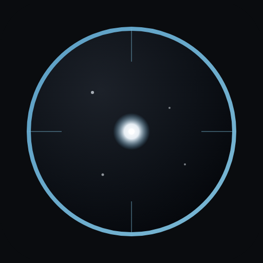

<div align="center">



# Nightshade

### One observatory. One control room. The whole night.

Plan the target, connect the rig, frame and solve the field, run the sequence, guide, watch the weather, and review the session — from one application.

[](https://github.com/Scdouglas1999/Nightshade/releases/latest)
[](#what-is-actually-verified)
[](#platforms-and-downloads)
[](#remote-observatory)
[](LICENSE)

[**Download**](https://github.com/Scdouglas1999/Nightshade/releases/latest) · [Documentation](docs/index.md) · [6.0.0 release notes](docs/release/v6.0.0.md) · [Known limitations](docs/known-limitations.md) · [Support development](https://www.patreon.com/cw/SeanDouglas)


</div>

---

Nightshade controls an astrophotography rig end to end. Equipment, planetarium, framing, sequencing, imaging, guiding, weather, safety, and analytics all work from the same target, the same equipment profile, and the same live session, instead of a separate program for each job.

A Rust core owns the running sequence and the imaging pipeline. The Flutter desktop app, a browser dashboard, and an Android companion are views onto that same run, so closing a control surface does not end the night.

> [!IMPORTANT]
> Nightshade is a **public beta**, and it has not been validated on-sky. Supervise complete sessions on your own equipment — slew, focus, guide, capture, meridian flip, safing, and park — before relying on unattended operation. Read [what is actually verified](#what-is-actually-verified), the [supported-hardware matrix](docs/supported-hardware-by-platform.md), and the [known limitations](docs/known-limitations.md) first.

## What is actually verified

This project scopes support to evidence, not to the presence of a code path. The statement below is the release's scoped capability claim, and it is repeated word for word in the [6.0.0 release notes](docs/release/v6.0.0.md) and in [`docs/known-limitations.md`](docs/known-limitations.md).

> Real-hardware validation for 6.0.0 was a Windows bench run between 22 and 26 July 2026 against an ASCOM Pegasus NYX-101 mount, a native ZWO ASI1600MM-Cool camera, and a ZWO EFW filter wheel, alongside a simulator instance. Camera connect, cooling, exposure, and image download are exercised on that hardware. **The mount was never commanded to move**, so slew, sync, park, unpark, homing, and meridian flip are unexercised on real equipment. **No frame was taken under a real sky** — the acquisition path is validated, the sky is not. The web dashboard and the Android companion were driven against a running host, but a second physical device on a real LAN with a firewall in the path was not tested. Fully-unattended **headless** acquisition and a full-night soak are **not** verified and must be supervised. **Linux** is early testing; **macOS** and **iOS** are unbuilt, untested, and ship no artifact. Every other device path — switches, domes, covers, and the remaining vendor SDKs — is **capability-gated**: present in the app, but not a support guarantee until it is verified on your rig.

Everything else in this README describes capability that exists in the source and is reachable from the user interface. That is a weaker claim than "verified on your hardware", and it is deliberately kept separate from it.

## Built for the whole night

<table>
<tr>
<td width="50%">
<h3>Plan with the real sky</h3>
<p>Explore an interactive planetarium, score targets against altitude, Moon, horizon, and darkness constraints, then compose exact framing and mosaic panel grids over survey imagery fetched from CDS HiPS2FITS or NASA SkyView.</p>
</td>
<td width="50%">
<h3>Run with a real engine</h3>
<p>Build sequences from instruction nodes plus loops, conditionals, parallel branches, and triggers. A Rust executor owns the run, writes session checkpoints, and can resume from one after a restart.</p>
</td>
</tr>
<tr>
<td>
<h3>Control the whole rig</h3>
<p>Cameras, mounts, focusers, filter wheels, rotators, domes, covers, switches, weather stations, and safety monitors, through ASCOM COM on Windows, ASCOM Alpaca, INDI, and capability-gated native vendor SDKs.</p>
</td>
<td>
<h3>Know what happened</h3>
<p>Star detection, HFR, FWHM, and eccentricity are measured in Rust from the captured frames. Grading, integration totals, guiding RMS, and session history are stored in a local database you can query and back up.</p>
</td>
</tr>
</table>

<div align="center">

</div>

<div align="center">


</div>

## From target to finished session

<table>
<tr>
<td width="50%"></td>
<td width="50%"></td>
</tr>
<tr>
<td><strong>Decide.</strong> Compare scheduler-ranked targets under the same altitude, horizon, darkness, and safety constraints the automation engine will enforce.</td>
<td><strong>Compose.</strong> Plate-solve, center, rotate, and lay out mosaic panels against registered survey imagery before spending clear-sky time.</td>
</tr>
<tr>
<td></td>
<td></td>
</tr>
<tr>
<td><strong>Track.</strong> Drive PHD2 from the same workspace — or use the built-in multi-star guider — and hold capture until dither settling completes.</td>
<td><strong>Protect.</strong> Combine weather, safety monitor, twilight, Sun altitude, and disk conditions into one host-authoritative safety verdict.</td>
</tr>
<tr>
<td></td>
<td></td>
</tr>
<tr>
<td><strong>Review.</strong> Follow frame quality, integration totals, guiding history, and the run decisions behind them. Quality labels are advisory: Nightshade does not delete or auto-reject your frames.</td>
<td><strong>Calibrate.</strong> The Flat Wizard measures median ADU, converges on an exposure inside your tolerance band, and reports non-convergence as an error rather than shipping a bad flat.</td>
</tr>
</table>

## Automation that explains itself

- **One set of contracts.** Plan Tonight and Unattended Autopilot share the same target scoring, horizon, darkness, and safety contracts, so the preview and the live run cannot disagree about what is next.
- **Resilient sequences.** Retries, checkpoint resume, meridian flips, dithering, V-curve autofocus, and calibration are instruction nodes inside the run, not separate scripts around it.
- **Fail-closed safety.** Unknown or stale safety state is not treated as clear: the default resolution for "no weather data" is *unsafe*, in both the Dart provider and the Rust executor. Unsafe weather, critical disk space, or an emergency stop can pause capture and drive the rig toward park, dome, and cover safety.
- **Structured history.** Automation decisions and recovery actions are emitted as events and persisted, so a night can be replayed instead of guessed at.
- **One owner.** The native sequencer owns an active run; desktop, mobile, and browser surfaces observe and control that same session rather than creating competing copies.

## Remote observatory

Nightshade runs as a desktop application or as a headless host at the telescope. The hardware authority stays where the equipment lives, and control surfaces attach to it over the LAN.

| Surface | Best for | What it is |
|---|---|---|
| **Desktop app** | Setup, planning, sequencing, imaging, analysis | The full control surface |
| **Headless host** | A dedicated observatory computer or appliance | Same binary with `--headless`; automation core plus an authenticated HTTP API |
| **Web dashboard** | Fast access from a LAN browser | Served by the host at `/dashboard`; device, sequencer, guiding, gallery, and log panels |
| **Mobile companion** | Checking or intervening away from the desk | Android: pairing, monitoring, camera/mount/sequencer control |
| **Second desktop** | A full-size remote control room | Master/slave live session mirroring over the LAN |

<div align="center">

</div>

Details worth knowing before you expose a host:

- The headless server binds to **loopback on port 8080** by default. It binds to the LAN only once authentication is configured, or when you explicitly pass `--allow-unauthenticated-lan`.
- Authentication **fails closed**. With no token configured, privileged routes return `401`. Only the onboarding surface — pairing, `/api/info`, and the static dashboard — stays reachable so a fresh appliance can still be bootstrapped. Serving everything open requires `--allow-unauthenticated`, and doing that on the LAN requires the second flag as well.
- Tokens carry coarse (`view` / `control` / `admin`) or fine-grained per-resource scopes.
- **Push notifications:** LAN push works out of the box. Off-LAN push over FCM or APNs is implemented but **dormant** — it delivers nothing until you provision your own push credentials on the host.

Read the [secure headless setup guide](docs/headless-secure-setup.md) before putting a host on a network you do not control, and the [firewall notes](docs/troubleshooting/firewall.md) when a second device cannot reach it.

## Beyond capture

- **Your Sky** folds plate-solved frames into a personal HEALPix sky atlas that deepens as you image.
- **First Light** reviews transient candidates and cross-matches them. It can submit to **TNS** through the real API; **AAVSO** and **MPC** output are file exports you submit yourself.
- **Constellation** and **Collaborative Sky** cover shared calibration libraries, claimable distributed mosaic panels, and live co-imaging sessions. These are **self-hosted only** — there is no public Nightshade hub and no default hub URL. You run [`server/nightshade_hub`](server/nightshade_hub/README.md) or point at a club hub you trust.
- **Science workflows** include photometric calibration against catalog references, Lomb-Scargle and BLS period analysis, and AAVSO / MPC / Markdown report exports.
- **Backup** targets a local folder, WebDAV, or an S3-compatible endpoint (AWS S3, MinIO, Backblaze B2), with credentials held in the operating-system keyring. Cloud *restore* is currently a desktop-app action, not a headless one.

## Hardware support

Nightshade speaks several device backends. A backend being available means Nightshade can attempt discovery and connection on that platform — individual drivers still report their own narrower capabilities after they connect.

| Backend | Windows | Linux | macOS | Notes |
|---|:---:|:---:|:---:|---|
| **ASCOM COM** | Available | — | — | Requires Windows COM, the ASCOM Platform, and installed device drivers |
| **ASCOM Alpaca** | Available | Available | Available | Network devices and bridges; capability gaps are reported by the Alpaca server |
| **INDI** | Available | Available | Available | Requires a reachable INDI server; depth varies per driver |
| **Native SDK** | Gated | Gated | Gated | Requires compatible user-installed vendor libraries and OS drivers |

This table is the same matrix the app shows under Settings → Connection → Platform Capabilities and serves from `/api/info`. If they ever disagree, that is a bug.

Native camera drivers exist for **ZWO ASI, QHY, Player One, SVBony, Atik, FLI, Moravian, and the Touptek family**. Native mount protocols cover **SkyWatcher/Synta, iOptron, and LX200-family serial** (Meade, OnStep, Losmandy, 10Micron). Official packages redistribute **no** proprietary vendor SDK binaries — a native path only lights up when you have installed the vendor's own library and driver.

**Plate solving is external.** Nightshade drives **ASTAP** or **astrometry.net `solve-field`**; install one of them and point Nightshade at it. There is no built-in blind solver.

**Guiding** works through **PHD2** over its JSON-RPC socket, or through Nightshade's own multi-star internal guider.

Check the [platform and hardware matrix](docs/supported-hardware-by-platform.md) before building an equipment profile.

## Platforms and downloads

The release workflow builds and publishes exactly three products:

| Artifact | Platform | Distribution status |
|---|---|---|
| `nightshade-6.0.0-windows-x64.zip` | Windows x64 | Portable desktop app; Authenticode-signed only when the release owner has provisioned a certificate |
| `nightshade-6.0.0-linux-x64.tar.gz` | Linux x64 | Portable bundle, glibc 2.35-linked; early testing |
| `nightshade-6.0.0-android-arm64-v8a.apk` | Android | Companion app; also built for `armeabi-v7a` and `x86_64`. Debug-signed until a keystore is provisioned |

There is **no macOS and no iOS artifact**. The macOS desktop app compiles in CI as a debug build, but its native Rust bridge build is not enforced there, no packaged artifact is produced, and neither macOS nor iOS has been run against hardware. Treat both as source-only.

Every application artifact ships a matching `.sha256`. Desktop archives also contain `NIGHTSHADE-LICENSE.txt`, `THIRD_PARTY_NOTICES.md`, the applicable third-party license text, and a `SOURCE-COMMIT.txt` recording the exact commit they were built from.

> [!NOTE]
> The Windows package includes `updater.exe` and the app can verify Ed25519-signed update manifests with anti-rollback protection. Until the release owner provisions signing keys and an update server, **the updater refuses everything and updates are manual**. A present updater binary is not a working auto-update. Self-update is Windows-only in any case; back up your configuration and database before replacing a bundle.

### System requirements

- **Windows:** Windows 10/11 x64, 8 GB RAM minimum (16 GB recommended), a DirectX 11 GPU with 2 GB VRAM, and the ASCOM Platform if you use local ASCOM COM drivers.
- **Linux:** x86-64 with glibc 2.35 or newer, an OpenGL 3.3-capable GPU, and GTK 3, libsecret, libusb, libudev, and OpenSSL at runtime. Vendor USB devices additionally need the vendor's udev rules, libraries, and group membership.
- **Storage:** roughly 500 MB for Nightshade, plus whatever your catalogs, previews, frames, and calibration data need.

## Install

1. Download the artifact for your platform and its `.sha256` from [GitHub Releases](https://github.com/Scdouglas1999/Nightshade/releases/latest), and verify the hash.
2. Extract the whole archive to a writable folder. Do not run the executable from inside the archive.
3. Launch it — `nightshade_desktop.exe` on Windows, `./nightshade` on Linux. Windows SmartScreen may warn about an unsigned binary; confirm the hash and the release source first.
4. **Download the sky catalogs on first run.** Star and deep-sky catalogs are *not* bundled in the installer; the app fetches them (HYG star catalogue, OpenNGC deep-sky) and verifies their checksums. Until you do this, the planetarium falls back to a handful of naked-eye stars.
5. Install what your rig needs but Nightshade cannot ship: the ASCOM Platform and your device drivers on Windows, an INDI server on Linux, PHD2 if you guide with it, and ASTAP or astrometry.net if you plate-solve.
6. Connect your first device and set an equipment profile.

Full walkthroughs: [installation](docs/getting-started/installation.md) → [first connection](docs/getting-started/first-connection.md) → [first image](docs/getting-started/first-image.md).

To run the same build as an appliance instead, start it headless and give it a token:

```
nightshade_desktop --headless --require-auth
```

## Known limitations

Every limitation accepted for this release is written down, with its user impact, its workaround, and whether it was treated as a release blocker:

**[docs/known-limitations.md](docs/known-limitations.md)**

The short version of what is *not* there yet: no on-sky validation, no full-night unattended soak, no second-device LAN and firewall test, no macOS or iOS artifact, no production signing or update server, no verified switch-device path, and INDI weather and switch parity that still needs checking on a real Linux or macOS observatory stack before you rely on it for unattended safety.

## Build from source

Nightshade is a Melos-managed Flutter workspace over a Rust core, joined by `flutter_rust_bridge`. Use the project scripts so generated bindings and native libraries stay in step.

```bash
dart pub global activate melos
melos bootstrap
./scripts/dev.sh          # Linux and macOS
```

On Windows the equivalent is `melos run dev`, which wraps `scripts/dev.ps1`. (The `melos run dev*` scripts are PowerShell-only; `scripts/dev.sh` is their Linux/macOS counterpart.)

| Command | Purpose |
|---|---|
| `./scripts/dev.sh` / `melos run dev` | Regenerate the FFI bridge, build Rust, stage native libraries, launch desktop |
| `./scripts/dev.sh --skip-frb` / `melos run dev:quick` | Rebuild without regenerating an unchanged FFI surface |
| `melos run generate` | Regenerate Drift, Freezed, JSON, and bridge code |
| `melos run test` | Run workspace tests (host-specific golden pixel tests excluded) |
| `melos run analyze` | Static analysis across all packages |
| `melos run build:desktop:linux` | Build the Linux desktop release |
| `melos run build:desktop:windows` | Build the Windows desktop release |

CI pins Flutter 3.44.1 and tracks stable Rust. Platform prerequisites and FFI troubleshooting live in the [developer documentation](docs/index.md) and the [FFI guide](docs/FRB_TROUBLESHOOTING.md).

## Documentation

| Start here | Operate Nightshade | Understand the project |
|---|---|---|
| [Installation](docs/getting-started/installation.md) | [Supported hardware](docs/supported-hardware-by-platform.md) | [Architecture](docs/architecture.md) |
| [First connection](docs/getting-started/first-connection.md) | [Known limitations](docs/known-limitations.md) | [Plugin SDK](docs/plugin_sdk/README.md) |
| [First image](docs/getting-started/first-image.md) | [Headless security](docs/headless-secure-setup.md) | [Headless API](docs/api/README.md) |
| [6.0.0 release notes](docs/release/v6.0.0.md) | [Backup and migration](docs/migration-backup-restore.md) | [Contributing](.github/CONTRIBUTING.md) |
| [Troubleshooting](docs/troubleshooting/common-issues.md) | [Remote control](docs/remote-control.md) | [Changelog](docs/CHANGELOG.md) |

The [Plugin SDK](docs/plugin_sdk/README.md) covers plugins compiled into the app, and working examples ship in `packages/nightshade_plugins`. Installing a third-party plugin binary into a released build is **not** supported: that endpoint returns `501`.

## Support the project

Nightshade is free to use, with no paid-only builds and no locked features. [Patreon](https://www.patreon.com/cw/SeanDouglas) support funds hardware testing, packaging, documentation, driver compatibility, and the long tail of failures that only show up under a real sky.

<p align="center">
  <a href="https://www.patreon.com/cw/SeanDouglas"></a>
</p>

Bug reports and hardware compatibility notes are the most useful thing you can send. Include your operating system, backend, exact equipment, driver versions, the sequence step, the logs, and what you actually observed. Read [CONTRIBUTING.md](.github/CONTRIBUTING.md) first, and report vulnerabilities privately using [SECURITY.md](.github/SECURITY.md).

## License

Nightshade is **source-available**, not OSI open source. You may inspect, build, and audit it under the terms in [LICENSE](LICENSE). Read those terms before redistributing Nightshade or building on its source.

---

<div align="center">

Built for clear skies, long nights, and observatories that should still be safe at sunrise.

[Download](https://github.com/Scdouglas1999/Nightshade/releases/latest) · [Docs](docs/index.md) · [Issues](https://github.com/Scdouglas1999/Nightshade/issues) · [Patreon](https://www.patreon.com/cw/SeanDouglas)

</div>
