<div align="center">


# Nightshade

**Run an entire unattended deep-sky night from one app.**

[](https://github.com/Scdouglas1999/Nightshade/releases/latest)
[](#platforms)
[](LICENSE)

[**Download**](https://github.com/Scdouglas1999/Nightshade/releases/latest) · [**Documentation**](docs/index.md) · [**Changelog**](CHANGELOG.md) · [**Release notes (3.1.0)**](docs/releases/3.1.0.md)

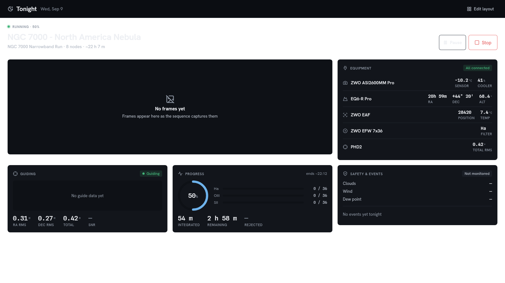

</div>

---

A clear-sky imaging night usually means a stack of programs: one to drive the camera, one to plan targets, a planetarium to frame, a sequencer to automate, a guider, and something to watch the weather. Each keeps its own profiles. Each fails in its own way. When a USB cable hiccups at 2 a.m., you find out in the morning.

Nightshade runs the whole night from a single program. Connect the rig, plan targets, frame and plate-solve, build the sequence, capture, guide, and watch the sky. Pick a target in the planner and it runs in the sequencer without re-typing coordinates. It targets the unattended night: it parks safely and recovers from disconnects on its own. The desktop app is the control surface. A LAN web dashboard and an Android companion supervise the same live session while you sleep.

## What it does

- Equipment, planetarium, planner, sequencer, imaging, guiding, weather, and analytics share one session model. Pick M42 in the planner and it runs in the sequencer with the same coordinates, rotation, and optics.
- End-of-night and emergency stops park the mount, close the cover, and close the dome to reach a real safe state. The run gates on twilight and Sun altitude, so it won't image in daylight, and weather-unsafe or low-disk conditions pause and park instead of imaging through them.
- A device that drops mid-sequence reconnects, re-acquires the guide star, and retries the interrupted instruction, so the night keeps going.
- One scheduler engine scores targets by altitude, moon, and per-azimuth horizon. The planner is a read-only preview of what the autopilot will actually run.
- ASTAP and astrometry.net solve every field, with RA unified to degrees across every solve path. Slew-and-center converges. Framing registers survey imagery to sky coordinates, mosaics included.
- A customizable tile dashboard shows live frames, HFR/FWHM/eccentricity, equipment telemetry, guiding, and weather. The Android companion and the web dashboard drive the full unattended-night control set over the LAN.

<div align="center">
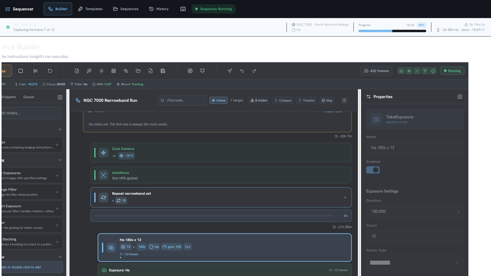
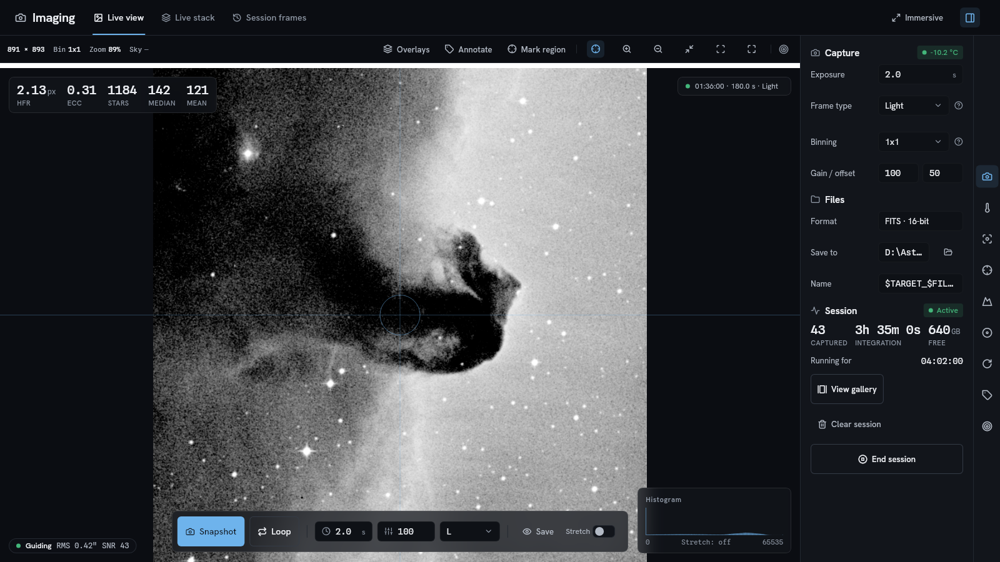
</div>

## A night with Nightshade

<table>
<tr>
<td width="50%">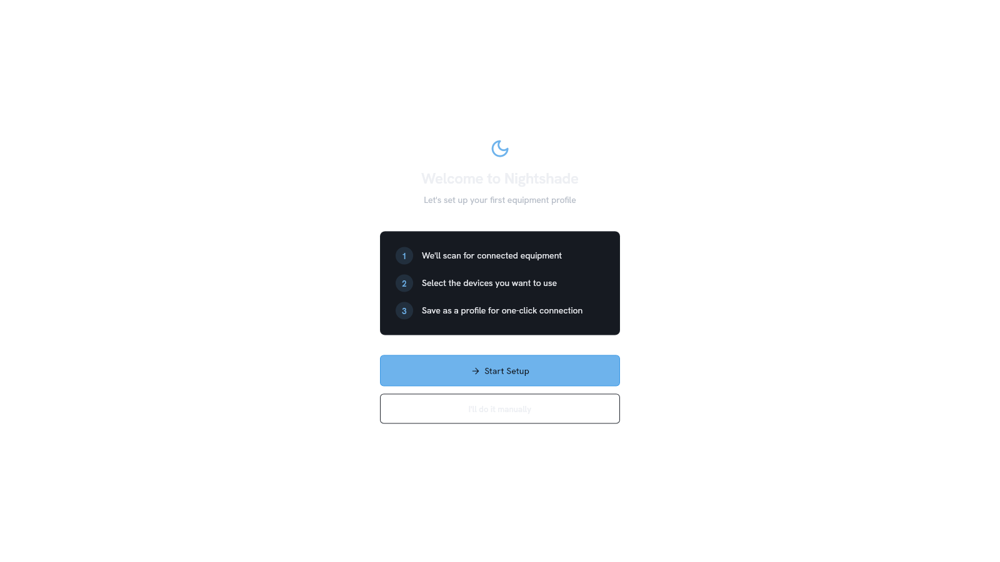</td>
<td width="50%">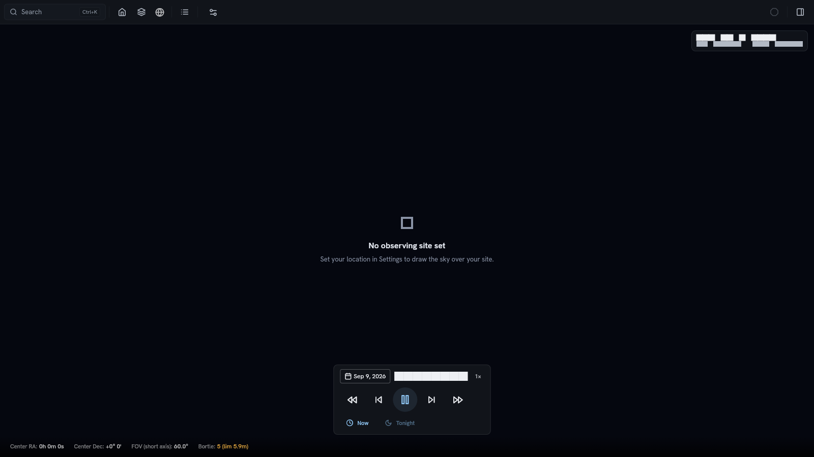</td>
</tr>
<tr>
<td>Discover and connect cameras, mounts, focusers, and wheels over ASCOM, Alpaca, INDI, or native SDKs. Save one profile that every screen shares.</td>
<td>Pan a GPU-rendered sky map with equipment FOV rings and a red night-vision mode to pick fields before committing time.</td>
</tr>
<tr>
<td>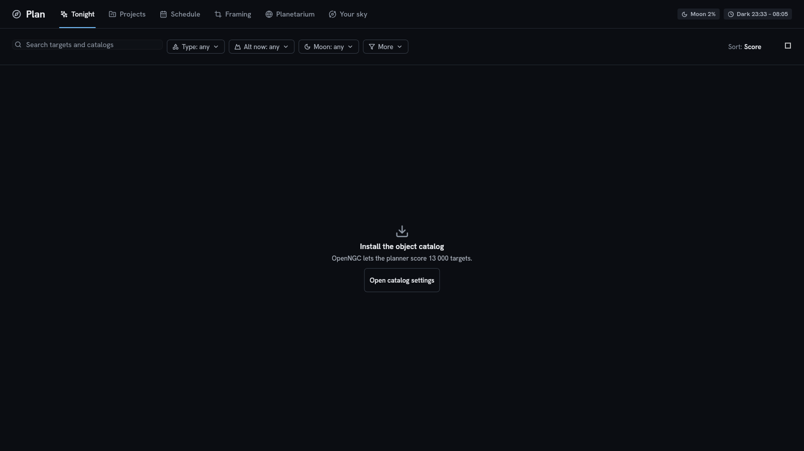</td>
<td>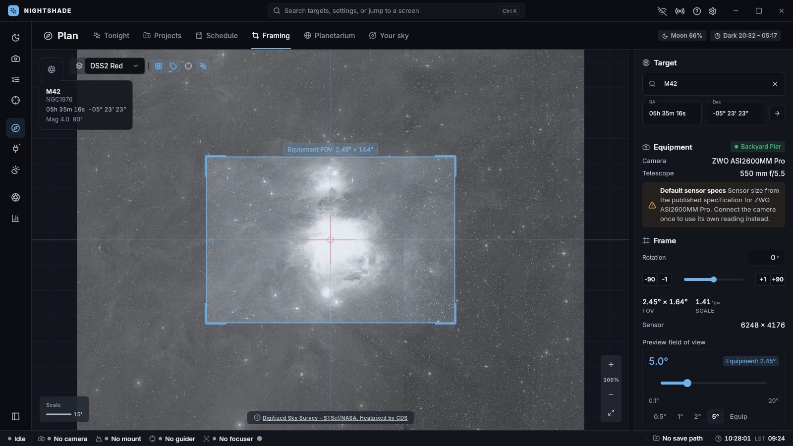</td>
</tr>
<tr>
<td>Read the live autopilot's scored target list and altitude windows. Send any candidate straight to the sequencer.</td>
<td>Register a plate-solved survey overlay to real sky coordinates so rotation and offset match the plan.</td>
</tr>
<tr>
<td>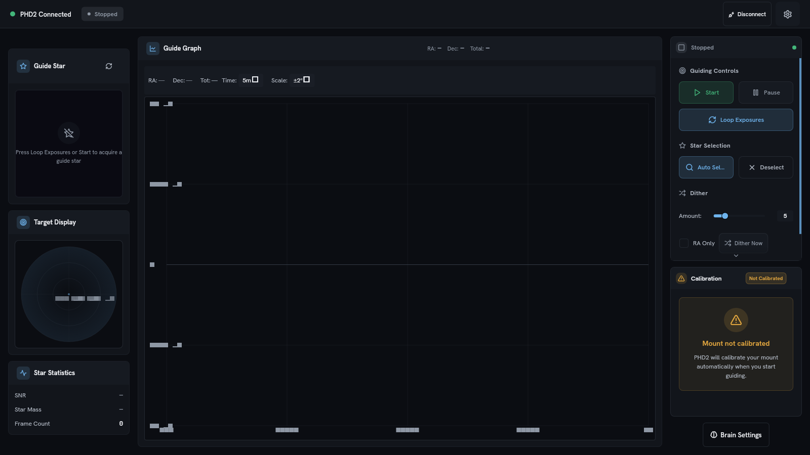</td>
<td>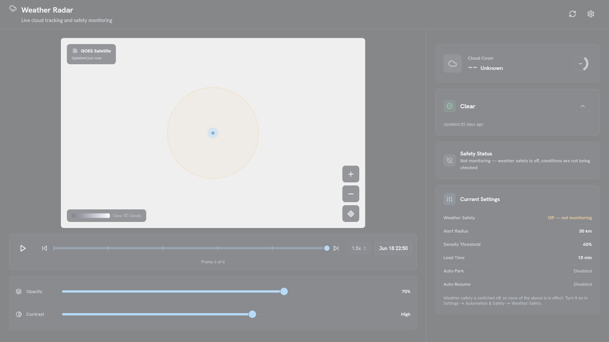</td>
</tr>
<tr>
<td>Run PHD2 inside Nightshade with RMS trends and dither-settle waits, while sequencer triggers watch tracking quality.</td>
<td>Read per-cell radar cloud-motion, with stated reasons when data is missing, feeding a single fail-closed safety verdict that can pause and park.</td>
</tr>
<tr>
<td>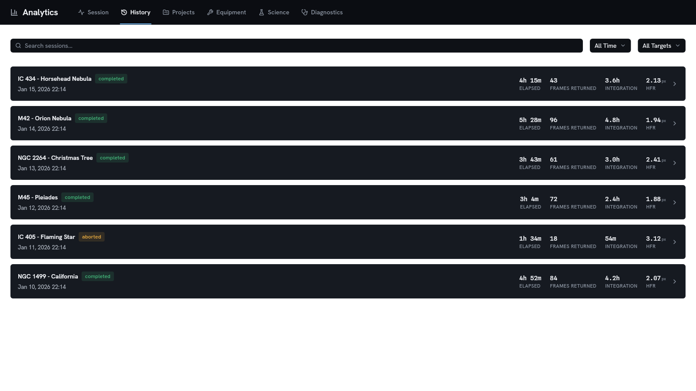</td>
<td>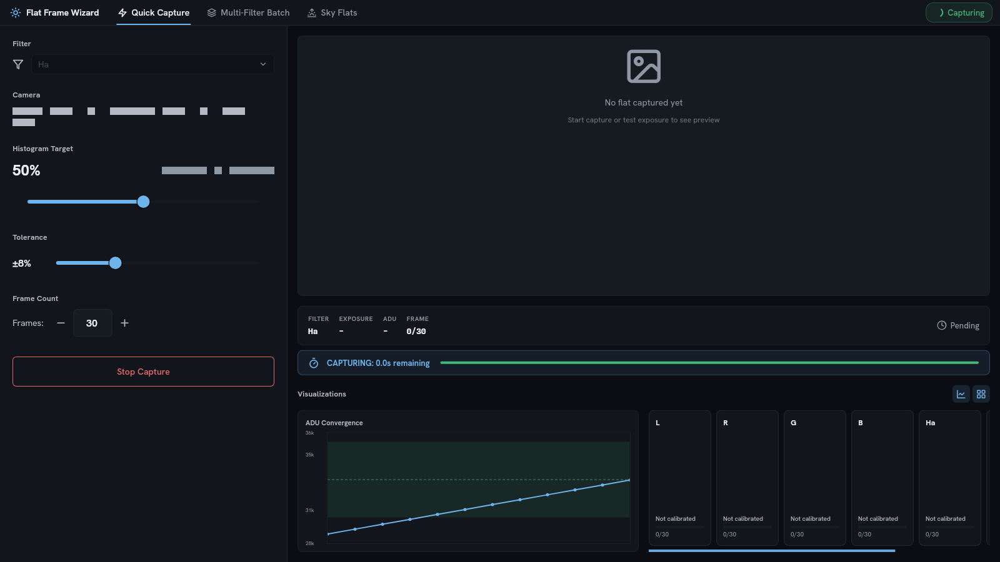</td>
</tr>
<tr>
<td>See frame-quality, HFR, and eccentricity trends plus per-target integration totals, computed from real metrics with rejected subs excluded.</td>
<td>Capture ADU-targeted, filter-aware flats at the camera's real gain and offset when the sequence or meridian calls for it.</td>
</tr>
</table>

Then step away. Supervise or drive the same live session from a LAN browser or the paired Android companion.

<div align="center">
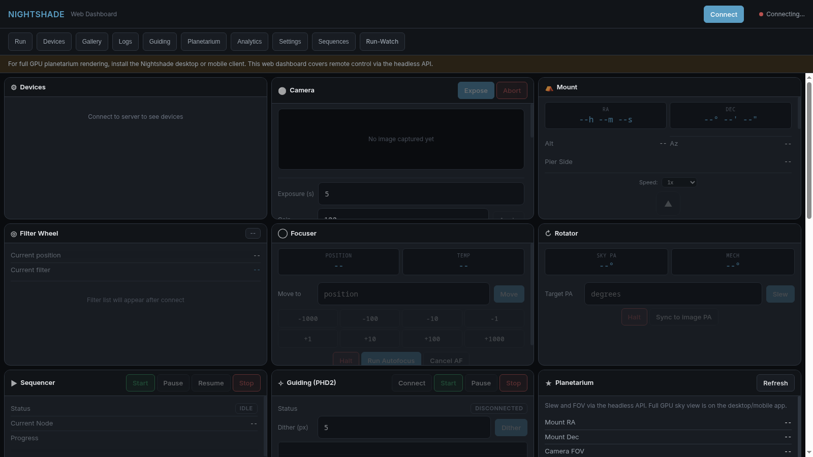
</div>

## What's new in 3.1.0

3.1.0 finishes the unattended night.

- **Safe-state on abort and park** now closes the cover and dome and brings the rig to a genuine safe state, not only halting the mount.
- **Disconnect, reconnect, resume.** A device dropping mid-sequence reconnects, re-acquires the guide star, and retries the interrupted instruction.
- A single weather-verdict authority with a real abstain channel, so "unknown" never reads as "safe." The Rust executor enforces the pause/park/close action as a second check.
- **Per-azimuth horizon mask** honored by both the runnable gate and the AltitudeAbove/Below loop conditions, plus count-based filter completion.
- **The planner is now a read-only preview** of the live autopilot, after three separate target-selectors were unified into one engine.
- **Per-sub eccentricity** computed from real star-shape moments, used to fire the grade gate, and shown as a color-graded cockpit overlay.
- **Live-stacking auto-feed.** Accepted frames build the live stack during sequencer runs and broadcast over the LAN.
- **Real per-cell radar** (RainViewer, NOAA, GOES) drives cloud-motion prediction, replacing the uniform-field placeholder and reporting honest reasons when data is absent.
- **Plate solving** unified RA to degrees across every solve path and made the local ASTAP fallback functional and fail-loud.
- **Slew-and-center converges** after fixing the solved-RA degrees-to-hours conversion. PHD2 dither waits for a real settle and fails closed.
- **Mobile remote parity** across the full unattended-night control set, with shortest-side device-class detection so foldables lay out correctly in landscape.
- **No daylight imaging.** The live scheduler gates on twilight and Sun altitude and parks at dawn through a distinct end-of-night hook.

Full detail: [docs/releases/3.1.0.md](docs/releases/3.1.0.md).

## Hardware support

Nightshade talks to devices through four backends. Coverage depends on the backend and your OS.

| Backend | Windows | Linux | macOS | Notes |
|---|---|---|---|---|
| ASCOM COM | Available | Unsupported | Unsupported | Needs Windows COM and locally installed ASCOM Platform/device drivers. Windows-only. |
| ASCOM Alpaca | Available | Available | Available | Network REST API for ASCOM devices and bridges. Capability gaps are reported by the Alpaca server. |
| INDI | Available | Available | Available | Needs a reachable INDI server. Feature depth depends on the driver and device properties. |
| Native SDK | Capability-gated | Capability-gated | Capability-gated | Depends on packaged vendor libraries, OS driver support, and redistribution approval. Verified per release. |

**Native camera SDKs:** ZWO ASI, QHY, Player One, SVBony, Atik, FLI, Moravian, and the Touptek family (Touptek, Altair, Mallincam, OGMA). DSLR capture (Canon/Nikon via gphoto2) exists in the codebase but is not a public-release guarantee.

**Native mounts:** SkyWatcher/Synta, iOptron, and LX200 (serial).

See [docs/supported-hardware-by-platform.md](docs/supported-hardware-by-platform.md) for the full matrix and [docs/known-limitations.md](docs/known-limitations.md) for current gaps.

## Platforms

Windows is the primary, hardware-tested path. Linux is in early testing. macOS builds in CI but ships no signed artifact and has had no hardware soak.

| Surface | Windows | Linux | macOS | Mobile |
|---|---|---|---|---|
| Desktop app | Tested (primary) | Early testing (compiles/runs on CI) | Builds in CI; no signed release artifact, no hardware soak | — |
| Headless server + API | Tested | Early testing | Builds in CI; untested on hardware | — |
| Web dashboard | Supported (browser on LAN) | Supported | Supported | Supported (browser) |
| Mobile companion | — | — | — | iOS + Android (QR pairing; monitor + light control). Android ships as an APK; iOS builds from source. |

## Install

Download the latest release: **[github.com/Scdouglas1999/Nightshade/releases/latest](https://github.com/Scdouglas1999/Nightshade/releases/latest)**

| Platform | Asset |
|---|---|
| Windows installer | `Nightshade-3.1.0-Windows-Setup.exe` |
| Linux x64 | `Nightshade-3.1.0-Linux-x64.tar.gz` |
| Android companion | `Nightshade-3.1.0-Android.apk` |
| macOS desktop | Not shipped for 3.1.0 (build from source) |
| iOS companion | Build from source (requires signing) |

The Android and iOS apps pair to a running desktop or headless instance by QR code over your LAN. They supervise and lightly control the live session; the desktop app remains the full control surface.

**System requirements**

- **Windows:** Windows 10 or 11 (64-bit). 8 GB RAM minimum (16 GB recommended). DirectX 11 GPU with 2 GB VRAM. About 500 MB plus image storage. ASCOM Platform is optional but required for local COM drivers.
- **Linux:** Ubuntu 22.04 LTS or equivalent. OpenGL 3.3 GPU. Runtime needs libgtk-3, libsecret-1, and a current glibc. INDI needs a reachable server; native USB/SDK paths may need vendor udev rules and dialout/plugdev/video group membership.

New to Nightshade? Start with the [installation guide](docs/getting-started/installation.md) and [first connection](docs/getting-started/first-connection.md). For headless and remote setups, see [headless / remote setup](docs/headless-secure-setup.md).

## Documentation

- [User documentation (index)](docs/index.md)
- [Installation guide](docs/getting-started/installation.md)
- [First connection](docs/getting-started/first-connection.md)
- [Supported hardware by platform](docs/supported-hardware-by-platform.md)
- [Known limitations](docs/known-limitations.md)
- [Headless / remote setup](docs/headless-secure-setup.md)
- [FFI troubleshooting](docs/FRB_TROUBLESHOOTING.md)
- [Release notes 3.1.0](docs/releases/3.1.0.md)
- [Changelog](CHANGELOG.md)

## Build from source

Nightshade is a Flutter front end over a Rust core, bridged with flutter_rust_bridge. The Dart bindings and the native library have to stay in sync, so the dev scripts handle codegen and DLL staging for you. Running plain `flutter run` will load stale bindings.

```bash
dart pub global activate melos
melos bootstrap          # link workspace packages and fetch deps
melos run dev            # FRB codegen + Rust build + copy native libs + run desktop
```

<details>
<summary><b>Full command reference and toolchain requirements</b></summary>

### Dev cycle

| Command | When |
|---|---|
| `melos run dev` | Full cycle on Windows: FRB codegen + Rust build + copy native DLLs + run desktop app (uses `scripts/dev.ps1`). |
| `melos run dev:quick` | Rust/Dart implementation changed but the FFI API is unchanged (skips FRB regen; `scripts/dev.ps1 -SkipFrb`). |
| `melos run dev:norun` | Rebuild native bridge + bindings without launching Flutter (`scripts/dev.ps1 -NoRun`). |
| `melos run dev:clean` | Clean all build artifacts and rebuild from scratch (`scripts/dev.ps1 -Clean`). |
| `melos run generate` | After model/API edits: regenerate freezed, drift, json_serializable, and FRB bindings (build_runner). |

### Release builds

| Command | When |
|---|---|
| `melos run build:desktop:windows` | Release Windows desktop (Rust release + `flutter build windows` + stage native DLLs). |
| `melos run build:desktop:linux` | Release Linux desktop (Rust release + `flutter build linux`). |
| `melos run build:desktop:macos` | Release macOS desktop (Rust release per-arch + `flutter build macos`). |
| `melos run build:mobile:android` | Build the Android companion APK. |
| `melos run build:mobile:ios` | Build the iOS companion (requires signing). |

### Quality gates

| Command | When |
|---|---|
| `melos run test` | Run Flutter tests across all packages. |
| `melos run analyze` | Run `dart analyze` in all packages. |
| `melos run format` | Format all packages (`dart format`). |

### Toolchain

- **Windows:** Visual Studio 2022 with "Desktop development with C++". LLVM/Clang on PATH for FRB/ffigen. Flutter 3.35+ (Linux release build uses 3.35.5; analyzer/test CI in `ci.yml` pins 3.24.0, so a contributor on 3.24.0 matches CI's analyze/test jobs). Rust stable, 2021 edition. Melos via `dart pub global activate melos`.
- **Linux:** `build-essential`, `clang`, `cmake`, `ninja-build`, `pkg-config`, `libgtk-3-dev`, `libsecret-1-dev`, `libjsoncpp-dev`. Flutter 3.35+, Rust stable. Vendor udev rules for native USB cameras where applicable.
- **macOS:** Xcode Command Line Tools. Code signing for device builds. Flutter 3.35+, Rust stable.

If codegen or the FFI boundary misbehaves, start with [docs/FRB_TROUBLESHOOTING.md](docs/FRB_TROUBLESHOOTING.md).

</details>

## Contributing

Bug reports, hardware coverage notes, and pull requests are welcome. Real hardware is hard to simulate, so test reports from actual rigs are especially useful: name the camera, the mount, the backend (ASCOM/Alpaca/INDI/native), the OS, and the sequence step where things went sideways. Start with [CONTRIBUTING.md](CONTRIBUTING.md) and the [docs index](docs/index.md). For security issues, see [SECURITY.md](SECURITY.md) to report privately.

## License

Nightshade is **source-available**, not open source. The source is published so you can read it, build it, and audit what runs on your observatory, but it is distributed under its own license terms rather than an OSI-approved open-source license. Read [LICENSE](LICENSE) before redistributing or building on it.

## Acknowledgments

Built on Flutter and Rust. Plate solving uses [ASTAP](https://www.hnsky.org/astap.htm) and [astrometry.net](https://astrometry.net/). Guiding integrates [PHD2](https://openphdguiding.org/). Device connectivity stands on the [ASCOM](https://ascom-standards.org/) and [INDI](https://indilib.org/) ecosystems and their driver authors, plus the camera and mount vendors whose SDKs make native support possible. Radar cloud-motion data comes from RainViewer, NOAA, and GOES. Thanks to everyone who runs Nightshade against real hardware under a real sky and reports back.
