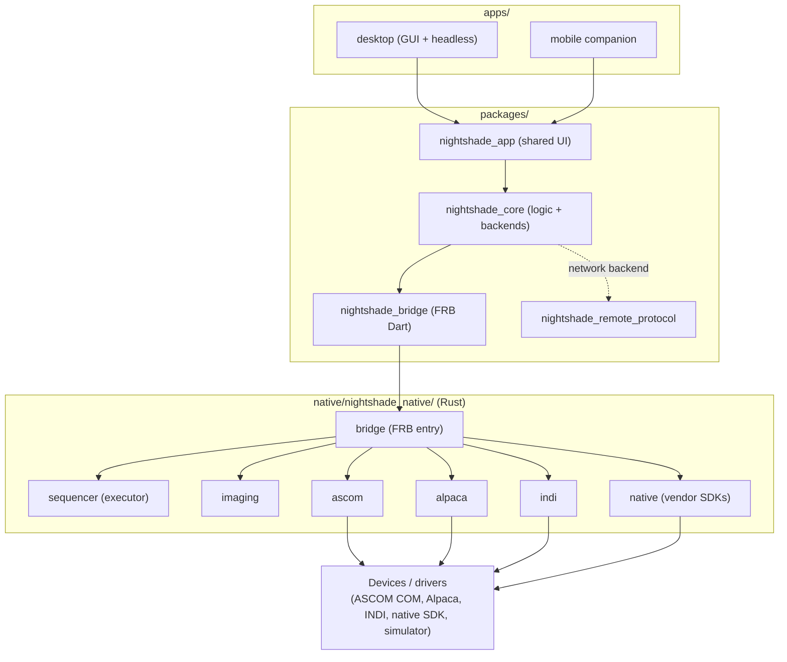

# Nightshade Architecture

> Status: reference for Nightshade 4.1.0.
>
> This document describes the system as it is built today: the package layering,
> the Dart/Rust boundary, the backend abstraction, the headless API, and the
> ownership rules that govern a running imaging session. It is meant to orient a
> contributor or reviewer quickly, and to be accurate against the code rather
> than aspirational. Where a precise file is not named, the role is described
> instead.

Nightshade is an astrophotography control application built from a Flutter UI
layer on top of a Rust core. The Rust side owns device drivers, image
processing, and the sequence executor; the Dart side owns the UI, application
state, and the network surfaces (headless API, mobile client, browser
dashboard). The two halves are joined by a single generated FFI bridge.

---

## 1. App / package layout

The repository is a Melos-managed Dart/Flutter workspace plus a Cargo workspace
under `native/nightshade_native/`.

**Apps** (`apps/`) are the deployable entry points:

- `apps/desktop` — the desktop application. Hosts both the GUI entry point and
  the headless appliance entry point (see §5).
- `apps/mobile` — the mobile companion client.
- `apps/mobile_e2e` — end-to-end harness for the mobile client.

**Packages** (`packages/`) are the shared libraries:

- `nightshade_core` — application logic, providers (Riverpod), and the backend
  abstraction. **This is the only Dart package that talks to the Rust bridge
  directly.**
- `nightshade_bridge` — the generated FFI surface (Dart side of the bridge).
- `nightshade_app` — UI shared across desktop and mobile.
- `nightshade_ui` — lower-level shared widgets / design system.
- `nightshade_planetarium` — sky rendering and catalog management.
- `nightshade_plugins` — the plugin host, registry, and node executor (§8).
- `nightshade_remote_protocol` — discovery, pairing, crypto, and push primitives
  shared between the headless server and the remote clients.
- `nightshade_updater` — update checks and manifest handling.

**Dependency direction.** The layering is strict and enforced by convention (see
`.github/CONTRIBUTING.md` → "Where to put new code"):

- `apps` depend on `packages`, never the reverse.
- `nightshade_app` depends on `nightshade_core`.
- `nightshade_core` is the only Dart package that depends on `nightshade_bridge`
  / talks to Rust.

New UI for desktop only goes in `apps/desktop/lib/`; UI shared across platforms
goes in `nightshade_app`; business logic and providers go in
`nightshade_core/lib/src/`.

---

## 2. The Dart/Rust boundary (FRB)

The Dart and Rust halves communicate through
[`flutter_rust_bridge`](https://cjycode.com/flutter_rust_bridge/) (FRB), pinned
in the workspace. Configuration lives in
`native/nightshade_native/flutter_rust_bridge.yaml`:

- **Bridge crate:** `native/nightshade_native/bridge` (crate
  `nightshade_bridge`). Its public API module (`crate::api`) is the FRB
  `rust_input`. This crate is built as a `cdylib`/`staticlib` and is the single
  Rust entry point that Dart links against.
- **Codegen output:** FRB generates the Dart wrapper into
  `packages/nightshade_bridge/lib/src/` and C headers into the platform folders
  of that package. The generated Rust glue (`bridge/src/frb_generated.rs`) is
  overwritten on every codegen run.
- **Running codegen:** codegen and the shared-library copy step are driven by
  `scripts/dev.sh` (Linux) / `scripts/dev.ps1` (Windows) and the
  `melos run dev` workflow. Running `flutter run` directly skips FRB
  regeneration and the library copy, which causes runtime hash mismatches — this
  is called out in `.github/CONTRIBUTING.md`.

The bridge crate exposes device control, imaging operations, and the sequencer
API to Dart, and streams events back through a unified event channel that Dart
maps into application state (`backend/bridge_event_mapper.dart`,
`backend/ffi_backend/event_mapping.dart`).

---

## 3. Backend role interfaces

`nightshade_core` abstracts all device and runtime operations behind a set of
**role interfaces** under
`packages/nightshade_core/lib/src/backend/roles/`:

- `DeviceBackend` — connect/disconnect, discovery, device control.
- `GuidingBackend` — guiding (PHD2 and built-in) operations.
- `ImagingBackend` — capture, calibration, image processing.
- `SequencerBackend` — sequence run lifecycle and runtime configuration.
- `ProfileSettingsBackend` — equipment profiles and settings.
- `DiagnosticsBackend` — diagnostics and health.

`NightshadeBackend` (`backend/nightshade_backend.dart`) is a **marker
interface** that composes all six roles. Concrete backends implement it, but new
code is expected to depend on the narrowest role it needs rather than the full
composite. Riverpod role-specific providers read through the same underlying
backend state, so swapping the active backend is a single state mutation. New
methods belong on a role interface, not on the `NightshadeBackend` marker.

---

## 4. Local vs network backend

There are three concrete backends, all implementing `NightshadeBackend`:

- **`FfiBackend`** (`backend/ffi_backend/`) — the local/native backend. It calls
  straight into the Rust bridge over FRB. This is what the desktop GUI and the
  headless appliance run with: they own the hardware directly.
- **`NetworkBackend`** (`backend/network_backend/`) — the remote backend. It
  speaks the headless HTTP/WebSocket API rather than FFI, so the same UI code can
  run against a Nightshade appliance over the network. This is the backend used
  by the mobile companion and the browser dashboard when they drive a remote rig.
  It mirrors the role surface over transport (`http_transport.dart`,
  `device_operations.dart`, `imaging_profile_operations.dart`, guiding,
  post-session, etc.).
- **`DisconnectedBackend`** (`backend/disconnected_backend/`) — a safe inert
  backend for the no-connection state. It only answers the roles it can
  legitimately answer.

Because all three implement the same role interfaces, the UI and providers are
backend-agnostic: a session driven locally over FFI and a session driven
remotely over the network use the same call sites.

---

## 5. Headless API

The desktop binary has two entry points, selected at launch:

- `apps/desktop/lib/main.dart` — GUI mode (default).
- `apps/desktop/lib/main_headless.dart` — headless/appliance mode, selected by
  `--headless` or `NIGHTSHADE_HEADLESS=1`. This runs without a window, suitable
  for a server/daemon or a dedicated appliance (e.g. a small single-board
  computer at the mount) controlled remotely.

The headless surface is split into two areas:

- `apps/desktop/lib/headless/` — bootstrap: auth config, device discovery,
  relay, disk watchdog, and service wiring.
- `apps/desktop/lib/headless_api/` — the HTTP/WebSocket server. Routes and
  handlers are organized one pair per domain: each `routes/<area>_routes.dart`
  declares a flat, declarative route table that binds paths to methods on the
  matching `handlers/<area>_handlers.dart`. Domains include devices, imaging,
  guiding, sequencer, calibration, scheduler, safety monitor, weather, catalog,
  planetarium, plugins, pairing, sync, and many more. A job manager, event
  replay buffer, command correlator, and push layer support long-running
  operations and live streaming (including WebRTC live view).

**Auth / token model (high level).** Authentication is token-based with three
scopes (`apps/desktop/lib/headless_api/auth_policy.dart`):

- `view` — read-only monitoring.
- `control` — imaging control.
- `admin` — full administrative control.

Each endpoint declares its required scope via route metadata; the middleware
resolves the caller's token to a scope and checks it. The policy **fails
closed**: any unrecognized or future scope name resolves to the highest
privilege requirement (`admin`) rather than silently granting `view`. Tokens are
provisioned at launch (`--auth-token`, `--view-token`, `--control-token`,
`--require-auth`), pairing is supported for clients
(`nightshade_remote_protocol`), and CORS origins are explicitly allow-listed.
TLS provisioning and WebSocket ticketing are handled in the same layer. See
`docs/headless-secure-setup.md` and `docs/remote-control.md` for operator
guidance.

---

## 6. Sequencer ownership

**The Rust sequencer owns the run. Dart is the control surface.**

The sequence executor lives in `native/nightshade_native/sequencer` (executor
under `sequencer/src/executor/`, behavior-tree nodes under `sequencer/src/node/`,
plus autofocus, meridian flip, mosaic, flat wizard, polar align, dual-rig, and
checkpoint/recovery modules). Once a run starts, the executor — not Dart — drives
the imaging loop: scheduling, triggers, frame verdicts, recovery transitions,
checkpoints, and park-on-give-up logic all execute in Rust.

Dart's responsibilities are to build/edit the sequence, start/stop/pause it
through the `SequencerBackend` role, and render the executor's event stream
(progress, decisions, recovery). Every executor decision is emitted as a
structured `DecisionEvent` (`sequencer/src/decision.rs`), surfaced on the unified
event stream, and persisted for the Replay screen — the persisted log is the
forensic source of truth. This split means a run survives a UI disconnect: the
executor keeps running on the appliance and the control surface can reattach.

---

## 7. Safety / fail-closed model

Safety is treated as an authority the executor enforces, not advice the UI may
ignore.

- **Verdict authority.** Weather and safety-monitor state produce a safety
  verdict consumed by the executor. The headless surface exposes it read-only at
  `/api/safety/status` (`routes/safety_monitor_routes.dart`); changing safety
  settings requires `control` scope.
- **Unknown is not safe.** An absent, stale, or undeterminable safety reading is
  treated as unsafe, never as a default-OK. The same posture runs throughout the
  stack: the runtime-config and decision paths use fail-closed defaults
  (`sequencer/src/node/runtime.rs`), the auth policy fails closed on unknown
  scopes (§5), and the codebase is gated by a documented fail-closed audit
  (`docs/production-readiness/fail_closed_rules.yaml`, enforced in CI).
- **Enforcement.** When the verdict goes unsafe (or a run gives up), the executor
  itself drives the rig to a safe state — parking the mount and closing the
  cover/dome — rather than relying on the operator or the UI to react. Park is a
  first-class executor node and outcome.

---

## 8. Plugin execution path

Plugins extend the sequencer with custom nodes. The host lives in
`packages/nightshade_plugins`:

- `plugin_host.dart` holds per-plugin `PluginContext`s.
- `plugin_node_registry.dart` records the available plugin-provided node types.
- `plugin_node_executor.dart` (`PluginNodeExecutor`) is the bridge between the
  registry, the per-plugin context, and a node's execution lifecycle.

When the sequence executor reaches a plugin node, the Dart-side `SequenceExecutor`
calls `PluginNodeExecutor.run(pluginId, nodeTypeId, params)`. The executor looks
up the definition, constructs a fresh node, validates parameters, runs it against
a wired `PluginContext`, and returns a **structured result rather than
throwing** — lookup failures, validation failures, thrown exceptions, and
timeouts (default 10 minutes) all map to a structured failure the sequencer can
act on. The plugin node executor is intentionally executor-agnostic: it does not
depend on the Rust bridge or on `nightshade_core` types. Plugins are managed over
the headless API at `/api/plugins` (upload, enable, disable, delete) via
`routes/plugin_routes.dart`. The plugin SDK is documented under
`docs/plugin_sdk/` and `docs/architecture/plugin-sequence-nodes.md`.

---

## 9. Release validation model

Release readiness is documented and gated rather than asserted:

- **CI gates** — `docs/ci-gates.md` is the canonical reference for the required
  checks on every PR (format, analyze, tests, clippy, placeholder/stub audit,
  fail-closed audit, dependency-duplicate check, coverage threshold). Each gate
  maps to a step in `.github/workflows/ci.yml` and blocks merge on red.
- **Release evidence** — `docs/release-evidence/` collects the per-release
  validation record (alongside `docs/release/` and `docs/releases/` notes such
  as `docs/release/v4.1.0.md`). Treat this as the place that holds the proof a
  release was exercised, not just described.
- **Supported hardware** — `docs/supported-hardware-by-platform.md` is the
  authoritative platform/driver support matrix. Capability and platform claims in
  release notes must match it; `docs/known-limitations.md` records the gaps.

---

## 10. Dependency-direction diagram



Plain-text summary of the same direction:

```
apps  →  packages (app)  →  core  →  bridge (Dart, FRB)  →  bridge crate (Rust)
                                                              →  sequencer / imaging
                                                              →  ascom / alpaca / indi / native
                                                              →  device drivers
```

The local path runs `core → FfiBackend → bridge → Rust`. The remote path runs
`core → NetworkBackend → headless API → (on the appliance) FfiBackend → bridge →
Rust`, so the same UI drives hardware whether it is attached locally or reached
over the network.
