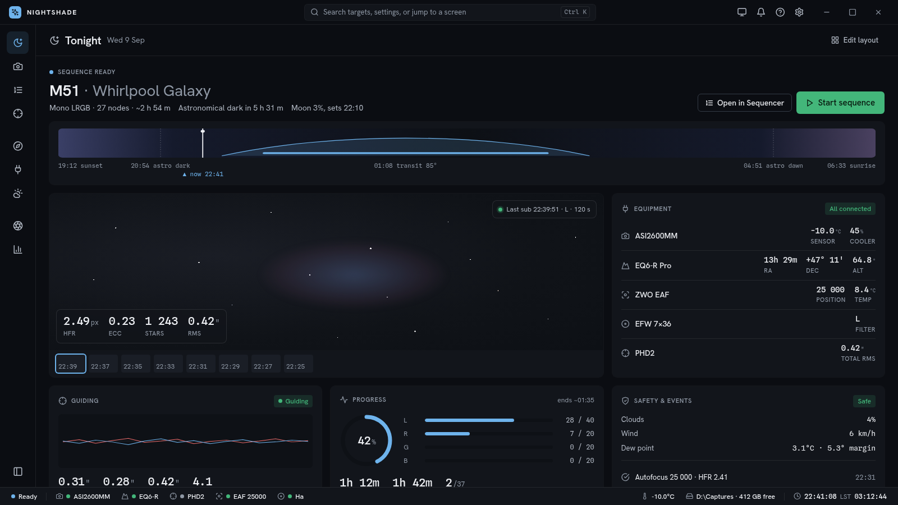

# Nightshade UI/UX overhaul — "Observatory"

A complete, hand-off-ready redesign of the Nightshade desktop (and shared mobile) UI, written on
2026-09-09 after driving the shipped 7.0.0 app screen by screen. Everything an implementing agent
needs is in this folder. Nothing here has been implemented yet.

**First step for any implementer:** this folder is untracked at the time of writing. Commit it to
`main` before branching wave 0, or the spec will not exist on the branch.

## Read in this order

| File | What it is | Who reads it |
|---|---|---|
| `01-audit.md` | What is wrong with the current UI, with screenshot evidence in `audit/` | everyone, once |
| `02-design-language.md` | The five rules, the vocabulary, the four signature moments | everyone, every time |
| `03-tokens.md` | Exact colour / type / space / radius / motion values AND the Dart edit for each | wave 0 agent; reference for all |
| `04-shell.md` | Top bar, rail, page header, instrument bar, narrow layout, command palette | wave 1 agent |
| `05-components.md` | Every shared component: API, sizes, states, what it replaces | wave 2 agent |
| `06-screens.md` | Screen-by-screen layout, removals, files | wave 3 agents (one per screen) |
| `07-implementation-waves.md` | The plan, the rules, the verification protocol, definitions of done | every agent, before starting |
| `design-tokens.json` | Machine-readable source of truth for tokens | scripts, wave 0 |
| `tools/check_tokens.py` | Validates contrast (WCAG AA on every surface, red-axis rule) and emits `mockups/tokens.css` | run after any token change |
| `mockups/*.html` + `mockups/render.sh` | The new design rendered as HTML with the app's real fonts and Lucide icons | anyone who wants to SEE the target |
| `mockups/png/` | Rendered references at 1600 × 900 (and 700 × 900 narrow), dark / light / red night | wave 3 agents compare screenshots against these |

## The design in one screen



Top bar with a global command field. Icon rail grouped Observe / Prepare / Review. One 56 px page
header. A hero line with the ONE primary action. The night band. Panels separated by tone, not
borders. Loud mono readouts with quiet labels. A single instrument bar at the bottom.

Other references: `tonight-empty.png` (first run with the checklist, expanded rail),
`imaging.png` (edge-to-edge frame with glass HUD and side panel), `sequencer.png`,
`equipment.png`, `plan.png`, `settings.png`, `components.png`, `narrow.png`. Light variants:
`*-light.png` for Tonight, Imaging, Sequencer, Equipment, Settings, Components. Red night:
`tonight-redNight.png`, `settings-redNight.png`, `narrow-redNight.png`.

## Regenerating the mockups

```bash
python3 docs/design/overhaul/tools/check_tokens.py      # validates + writes mockups/tokens.css
docs/design/overhaul/mockups/render.sh                  # all pages, all themes → mockups/png/
docs/design/overhaul/mockups/render.sh imaging          # one page
```

Needs `chromium` on PATH (set `CHROME=` to override). The mockups are plain HTML/CSS with no
build step; `shell.js` injects the shared chrome so every page shows the same shell, and the rail
list in `shell.js` is the same list as `04-shell.md` §3.2.

## Scope and non-goals

- Presentation layer only. Routes, providers, controllers, the database, the API and the Rust
  bridge are untouched. The mobile app inherits the shell and components automatically because it
  shares `packages/nightshade_app` and `packages/nightshade_ui`.
- No new features except the command palette (which is how route-only screens become reachable)
  and the first-run checklist (which replaces existing nags rather than adding capability).
- The planetarium, charts (`NightshadeChartColors`) and image rendering are not redesigned.
- Windows goldens cannot be regenerated on Linux; wave 4 lists that as an owner follow-up.

## How this was made

The shipped app was launched in the Linux GUI harness (`tools/ui_audit/drive_linux.py`) on a fresh
profile, then with an observing site, simulated camera / mount / focuser, a captured frame and a
loaded LRGB sequence, in all three themes, with the rail collapsed and expanded, and at a 700 px
width. Thirty screenshots are in `audit/`. The structural map of the shell, router and design-
system adoption counts came from reading `packages/nightshade_app/lib/screens/shell/`,
`router/app_router.dart` and `packages/nightshade_ui`. The palette was then re-derived and
validated with `tools/check_tokens.py`, and the mockups were built and rendered with the app's own
bundled fonts and the Lucide icon font from the pub cache.
